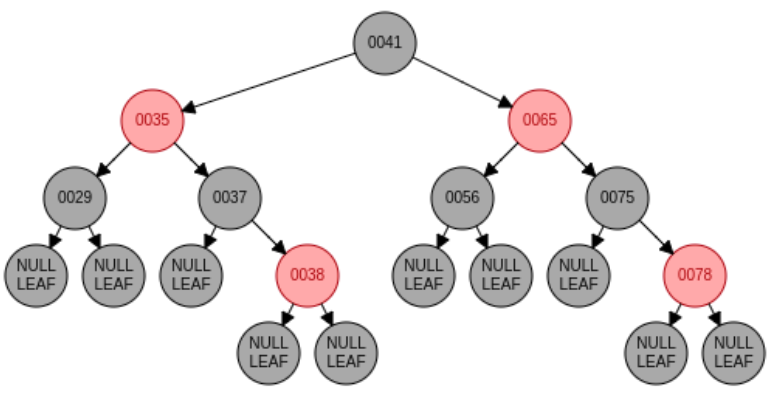

# 红黑树
>定义：R-B Tree，全称是Red-Black Tree，又称为“红黑树”，它一种特殊的二叉查找树。红黑树的每个节点上都有存储位表示节点的颜色，可以是红(Red)或黑(Black)。
## 特点
1. 每个节点或者是黑色，或者是红色。
2. 根节点是黑色。
3. 每个叶子节点（NIL）是黑色。 [注意：这里叶子节点，是指为空(NIL或NULL)的叶子节点！]
4. 如果一个节点是红色的，则它的子节点必须是黑色的。
5. 从一个节点到该节点的子孙节点的所有路径上包含相同数目的黑节点。[这里指到叶子节点的路径]

## 应用场景
- linux线程调度
- Mysql的Innodb数据库引擎
>Linux线程相关的知识点，如何查看其底层结构的实现？
