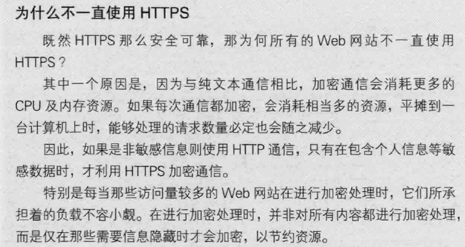

# HTTP

## 协议规定
请求从客户端发出，最后由服务端响应该请求。

## 请求报文的组成
1. 请求方法
2. 请求URL
3. 协议版本
4. 可选的请求首部字段
5. 实体内容

## 响应报文的组成
1. 协议版本
2. 状态码
3. 状态码的原因短语
4. 响应首部字段
5. 主体

## HTTP方法
- GET方法
它本质就是发送一个请求来取得服务器上的某一资源。
- POST方法
用来传输实体的主体
- PUT方法
用来传输文件
- HEAD方法
获得报文首部
- DELETE
删除URL指定的资源

## 使用Cookie来进行状态管理

## HTTP报文

## HTTP状态码

### 2xx的状态码
- 204：返回的响应报文中不含实体的主体部分。
- 206：客户端进行范围请求，而服务器成功执行了这部分的GET请求

### 3xx的状态码
- 301：永久性重定向。该状态码请求的资源已被分配了新的URL，以后应该使用资源现在所指的URL。
- 302：临时性重定向：该状态码请求的资源已被分配了新的URL，希望本次能使用新的URL访问。
- 303：由于请求对应的资源存在着另一个URL，应使用GET方法定向获取请求资源。
- 304：
- 307：临时重定向

### 4xx的状态码
- 400：Bad Request请求报文中存在语法错误
- 401：请求需要通过HTTP认证的认证信息
- 403：服务器理解请求客户端的请求，但是拒绝执行此请求
- 404：服务器无法根据客户端的请求找到资源（网页）
- 405：客户端请求中的方法被禁止
- 406：服务器无法根据客户端请求的内容特性完成请求
- 408：服务器等待客户端发送的请求时间过长，超时
- 412：客户端请求信息的先决条件错误

### 5xx的状态码
- 500：服务器内部错误，无法完成请求
- 501：服务器不支持请求的功能，无法完成请求
- 502：作为网关或者代理工作的服务器尝试执行请求时，从远程服务器接收到了一个无效的响应
- 503：由于超载或系统维护，服务器暂时的无法处理客户端的请求。延时的长度可包含在服务器的Retry-After头信息中
- 504：充当网关或代理的服务器，未及时从远端服务器获取请求
- 505：服务器不支持请求的HTTP协议的版本，无法完成处理

## HTTP的缺点
1. 通信使用明文，内容可能会被监听
2. 不验证对方的身份，因此有可能遭遇伪装
3. 无法证明报文的完整性，所以有可能报文被篡改

# HTTPS = HTTP + 加密 + 认证 + 完整性保护
>HTTP通信接口部分用SSL和TSL协议代替

## SSL公开加密技术
## HTTPS的缺点

## HTTPS和HTTP的区别
1. HTTPS协议需要申请证书，需要花钱。
2. HTTP是明文传输，HTTPS是具有安全性的SSL加密传输协议。
3. HTTP使用的端口是80，HTTPS的端口是443.
4. HTTP链接相对简单高效，HTTPS由于需要SSL导致通信慢以及处理速度慢。