# HTTP

## 各种协议与HTTP协议的关系
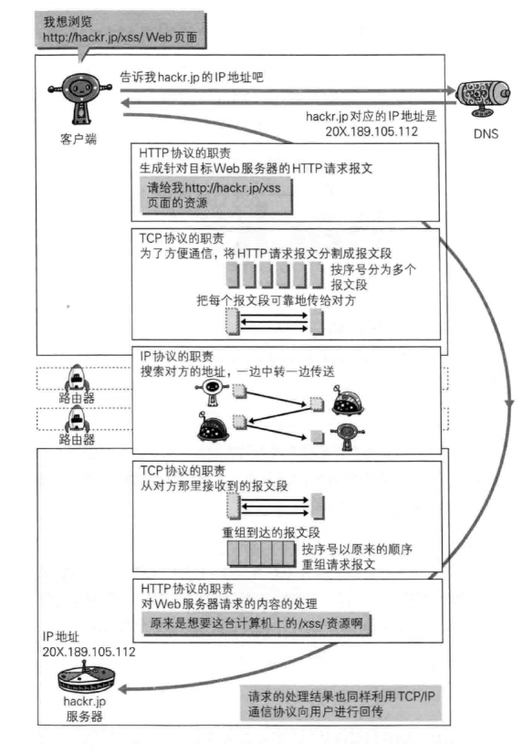

## 协议规定
请求从客户端发出，最后由服务端响应该请求。

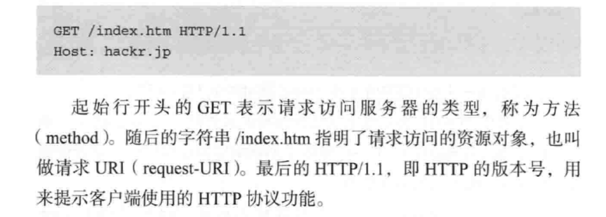

## 请求报文的组成
1. 请求方法
2. 请求URL
3. 协议版本
4. 可选的请求首部字段
5. 实体内容
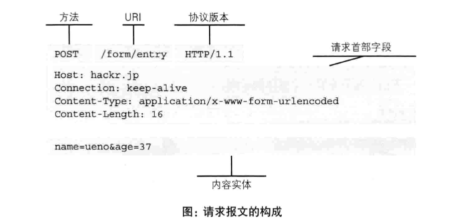
>[HTTP请求头](https://www.cnblogs.com/jycboy/archive/2017/02/17/http_head.html)

## 响应报文的组成
1. 协议版本
2. 状态码
3. 状态码的原因短语
4. 响应首部字段
5. 主体
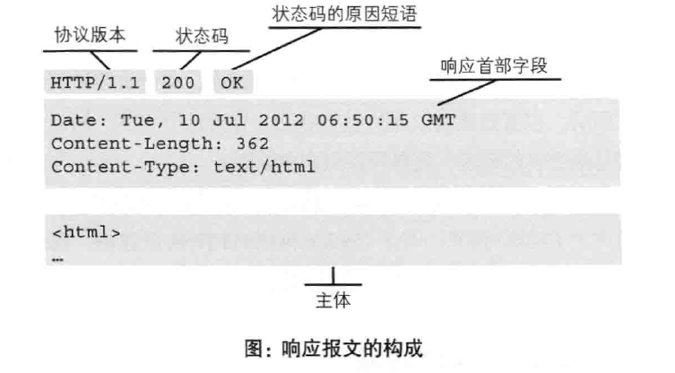

## HTTP方法
- GET方法
它本质就是发送一个请求来取得服务器上的某一资源。
- POST方法
用来传输实体的主体
- PUT方法
用来传输文件
- HEAD方法
获得报文首部
- DELETE
删除URL指定的资源
>[GET和POST区别](https://juejin.im/post/5cb67cf1518825324e689f69)

## 使用Cookie来进行状态管理
>由于HTTP不对请求和响应的状态进行保存。为了实现保存状态的功能引入了Cookie。

1. setCookie
- HttpOnly:使JavaScript脚本无法获得Cookie
2. Cookie
- 设置字段属性和值

**作用**
Cookie技术通过在请求和响应报文中写入Cookie信息来控制客户端的状态。

## 通信数据转发程序：代理、网关、隧道
### 代理
代理服务器的基本行为就是接受客户端发送的请求后转发给其他服务器。

**作用**
- 利用缓存技术减少网络带宽的流量
- 组织内部针对特定网站的访问控制
- 以获取日志为主要目的

### 缓存代理
代理转发响应时，缓存代理会预先将资源的副本保存在代理服务器上。当再次收到对相同资源的请求时，直接返回之前缓存的内容。
### 透明代理
不对请求和响应做任何的处理
### 网关
网关能使通信线路上的服务器提供非HTTP协议服务。
利用网关能提高通信的安全性。？？？
### 隧道
保护客户端能与服务器进行安全通信。

## 持久链接减少额外开销

## HTTP报文
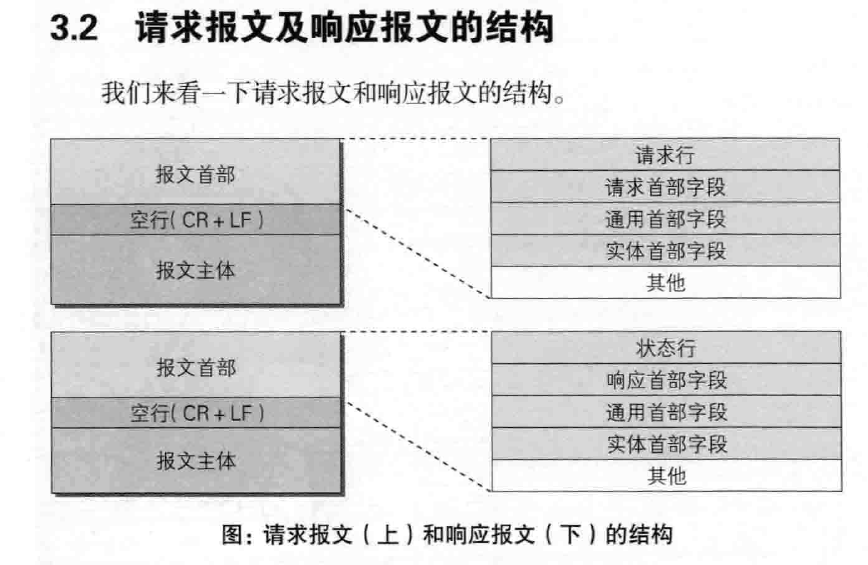

## HTTP状态码
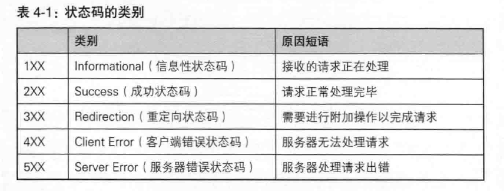

### 2xx的状态码
- 204：返回的响应报文中不含实体的主体部分。
- 206：客户端进行范围请求，而服务器成功执行了这部分的GET请求

### 3xx的状态码
- 301：永久性重定向。该状态码请求的资源已被分配了新的URL，以后应该使用资源现在所指的URL。
- 302：临时性重定向：该状态码请求的资源已被分配了新的URL，希望本次能使用新的URL访问。
- 303：由于请求对应的资源存在着另一个URL，应使用GET方法定向获取请求资源。
- 304：
- 307：临时重定向

### 4xx的状态码
- 400：Bad Request请求报文中存在语法错误
- 401：请求需要通过HTTP认证的认证信息
- 403：服务器理解请求客户端的请求，但是拒绝执行此请求
- 404：服务器无法根据客户端的请求找到资源（网页）
- 405：客户端请求中的方法被禁止
- 406：服务器无法根据客户端请求的内容特性完成请求
- 408：服务器等待客户端发送的请求时间过长，超时
- 412：客户端请求信息的先决条件错误

### 5xx的状态码
- 500：服务器内部错误，无法完成请求
- 501：服务器不支持请求的功能，无法完成请求
- 502：作为网关或者代理工作的服务器尝试执行请求时，从远程服务器接收到了一个无效的响应
- 503：由于超载或系统维护，服务器暂时的无法处理客户端的请求。延时的长度可包含在服务器的Retry-After头信息中
- 504：充当网关或代理的服务器，未及时从远端服务器获取请求
- 505：服务器不支持请求的HTTP协议的版本，无法完成处理

## HTTP首部
### 通用首部字段
请求报文和响应报文两方都会使用的首部

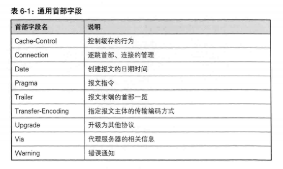

1. Cache-Control
通过指定首部字段的指令，能操作缓存的工作机制。
2. Connection
**作用**
- 控制不再转发给代理的首部字段：让代理服务器删除指定字段后在转发。
- 管理持久连接：当服务端想断开链接的时候，设置为Close
3. Date
创建HTTP报文的时间和日期。
4. Pragma
客户端会要求所有的中间服务器不返回缓存的资源。
5. Transfer-Encoding
规定了传输报文主体时采用的编码方式。
6. Via
为了追踪客户端与服务器报文的传输路径。
7. Warning
告知用户一些与缓存相关的问题的警告

### 请求首部字段
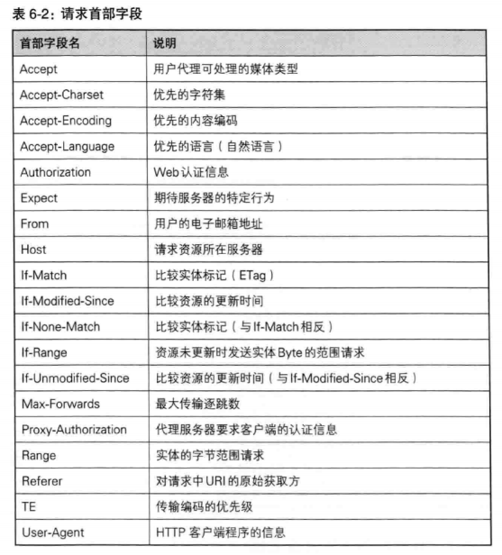

1. Accept
通知服务器，用户能够处理的媒体类型。（文本文件：text/html；图片文件；视频文件）
2. Accept-Charset
字符集的相对优先顺序。
3. Accept-Encoding
支持的内容编码优先顺序。
4. Accept-Language
能过处理的自然语言集
5. Authorization
6. Host
表明请求资源所处的互联网主机名和端口号。单台服务器分配多个域名的虚拟主机，需要在请求首部字段明确请求的主机名。
7. User-Agent
Mozilla/40(compatible;MSIE5.5;Windows NT 5.0) //浏览器信息

### 响应首部字段
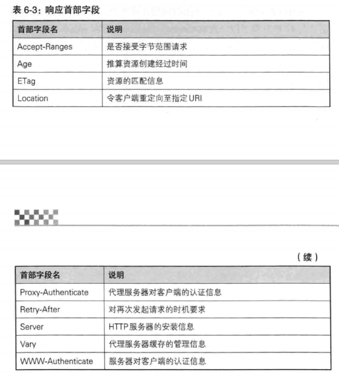

1. 
### 实体首部字段
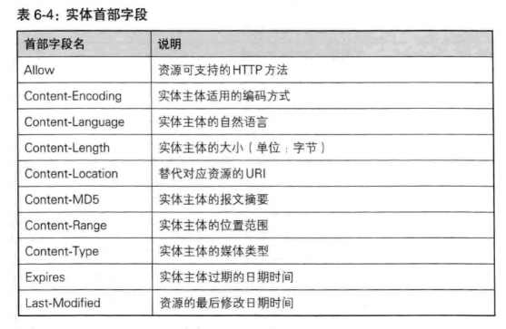
主要用做实体内容的元信息,表示实体内容的属性,包括实体信息类型，长度,压缩方法.最后一次修改时间,数据有效期等.

Allow :GET.POST
Content-Encoding:gzip
Content-Language:zh-cn
Content-Length:800                   //大小
Content-Location:HTTP://www.php-oa.com/index.html   //重定向到
Content-MD5: ABDEDFDEFERDFEFE==           //指出md5，可以算出内容是否被改变过
Content-Range:bytes 2543-4532/7878        //断点续传时用.
Content-Type:text/html;charset=GB2312     //指定文件类型，和字符集
Expires: Tue, 28 Jul 2008 16:49:49          //过期时间
Last-Modified:Tue 11 Jul 2008 16:49:4      //最后更新时间

1. Content-MD5
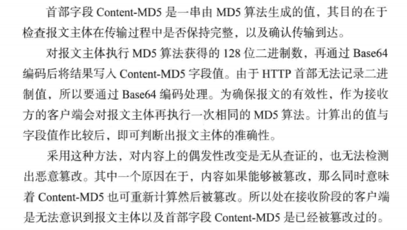

### 其他首部字段
1. DNT
2. P3P

## HTTP的缺点
1. 通信使用明文，内容可能会被监听
2. 不验证对方的身份，因此有可能遭遇伪装
3. 无法证明报文的完整性，所以有可能报文被篡改
### 如何防止篡改
#### MD5和SHA-1等散列值校验方法、数字签名方法、PGP

# HTTPS = HTTP + 加密 + 认证 + 完整性保护
>HTTP通信接口部分用SSL和TSL协议代替

<<<<<<< HEAD
## SSL公开加密技术
### 共享加密

### 公开密钥加密
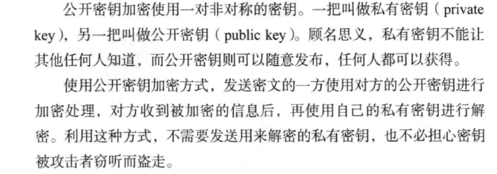

### 混合加密机制
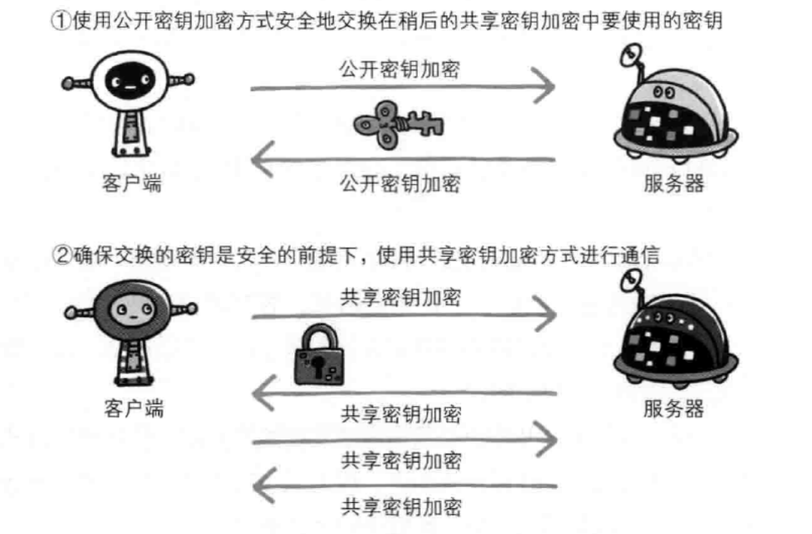
>无法证明公开密钥本身就是真的公开密钥，是不是正确的服务器发过来的。

### 证明公开密钥正确性的证书

## HTTPS加密过程

1. 客户端向服务器发起HTTPS请求，连接到服务器的443端口；

2. 服务器端有一个密钥对，即公钥（即数字证书）和私钥，是用来进行非对称加密使用的，服务器端保存着私钥，服务器将自己的证书发送给客户端；

3.  客户端收到服务器端的证书之后，客户端通过操作系统中已内置的公钥检查证书其合法性，如果发现发现证书有问题，那么HTTPS传输就无法继续，如果证书合格，则客户端会生成一个客户端密钥（pre-master secret 随机密码串），然后用服务器的公钥对客户端密钥进行非对称加密成密文，至此，HTTPS中的第一次HTTP请求结束；

4. 客户端发起HTTPS中的第二个HTTP请求，将加密之后的客户端密钥发送给服务器；

5. 服务器接收到客户端发来的密文之后，会用自己的私钥对其进行非对称解密，解密之后的明文就是客户端密钥，然后用客户端密钥对数据进行对称加密，这样数据就变成了密文；

6. 然后服务器将加密后的密文发送给客户端；

7. 客户端收到服务器发送来的密文，用客户端密钥对其进行对称解密，得到服务器发送的数据。这样HTTPS中的第二个HTTP请求结束，整个HTTPS传输完成。

## HTTPS和HTTP的区别
1. HTTPS协议需要申请证书，需要花钱。
2. HTTP是明文传输，HTTPS是具有安全性的SSL加密传输协议。
3. HTTP使用的端口是80，HTTPS的端口是443.
4. HTTP链接相对简单高效，HTTPS由于需要SSL导致通信慢以及处理速度慢。

## HTTPS认证方式

### BASIC认证
### digest认证
### ssl客户端认证
### 基于表单认证
用户登入时将自己的账号密码发送给服务器，服务器记录用户信息后，返回一个SessionID用来标识用户身份。

>给密码加盐后再使用散列函数计算出散列值后保存。
## 理解Cookie、Session、Token

- [彻底理解Cookie、Session、Token](https://www.cnblogs.com/moyand/p/9047978.html)

## 输入 url 到 显示网页的全过程
1. 首先会进行URL解析，判断输入的时一个合法的URL还是一个待搜索的关键词。（HSTS）接着调用DNS解析器进行DNS查询，查询过程为：浏览器缓存、本地hosts文件、路由缓存、DNS缓存，DNS域名服务器，（DNS域名服务器中维护了一个hosts数据库）由于NDS域名服务器是分层的，所以会先从底层开始查找，然后依次往上查找，直到根域名服务器。如果没有找到会显示无法访问此网站响应时间过长。
2. 如果找到了域名对应的IP地址接下来进行通过传输层建立端口到端口的TCP链接。
3. 建立链接后浏览器将发起一次http请求，首先是由应用层将请求数据进行编码，分组，并且编号排序，然后通过传输层、网络层、链路层分别在数据上封装对应的端口信息、IP地址和MAC地址，发给路由器，然后路由器进行分组转发（转发的细节）。
4. 接着服务器接受到请求后，将数据进行解码后根据http请求报文中的url进行响应。
5. 浏览器接收到来自服务器的响应资源后，会对资源进行分析。首先查看 Response header，根据不同状态码做不同的事（比如上面提到的重定向）。
6. 获取到响应内容后，浏览器内核开始渲染页面，主要是将HTML和Style构建成DOM树和CSS规则树，然后合成渲染树，通过重绘和回流等操作将内容显示到页面上。