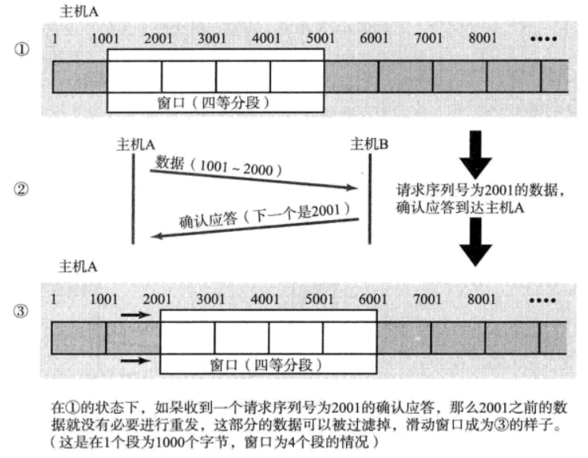
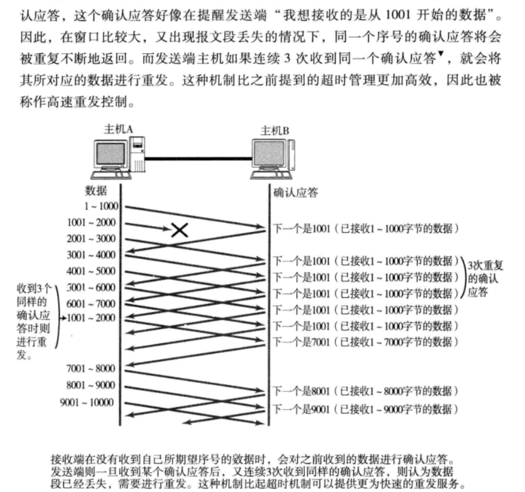

# TCP与UDP
## 传输层的作用
>让本机的端口与服务器的指定端口建立链接和断开链接。

## TCP
>TCP是面向链接的、可靠的流协议。
- 特点
1. 通过检验和、序列号、确认应答、重发控制、链接管理以及窗口控制等实现可靠性传输。

### 三次握手
- 第一次握手：客户端发送带有 SYN 标志的数据包给服务器。
- 第二次握手：服务器发送带有 SYN/ACK 标志的数据包给客户端。
- 第三次握手：客户端发送带有 ACK 标志的数据包给服务器

**为什么要三次握手**
因为，要确保通讯可靠就需要让双方知道互相发送消息是无误的。

即是要满足以下四点：
1. 客户端要知道 自己发送给服务器的消息可以成功到达；
2. 客户端要知道 服务器发送给自己的消息可以成功到达；
3. 服务器要知道 客户端发送自己给的消息可以成功到达；
4. 服务器要知道 自己发送给客户端的消息可以成功到达。
第一次握手时，服务器知道了 客户端 --> 自己可以到达，满足 3；
第二次握手时，客户端知道了 自己 --> 服务器 和 服务器 --> 自己可以到达，满足1 2；
第三次握手时，服务器知道了 自己 --> 客户端可以到达，满足 4。
所以需要三次，两次不能满足基本的可靠通讯，四次也不能100%的可靠。
**为什么TCP客户端最后还要发送一次确认呢？**
主要防止已经失效的连接请求报文突然又传送到了服务器，从而产生错误。

如果使用的是两次握手建立连接，假设有这样一种场景，客户端发送了第一个请求连接并且没有丢失，只是因为在网络结点中滞留的时间太长了，由于TCP的客户端迟迟没有收到确认报文，以为服务器没有收到，此时重新向服务器发送这条报文，此后客户端和服务器经过两次握手完成连接，传输数据，然后关闭连接。此时此前滞留的那一次请求连接，网络通畅了到达了服务器，这个报文本该是失效的，但是，两次握手的机制将会让客户端和服务器再次建立连接，这将导致不必要的错误和资源的浪费。

如果采用的是三次握手，就算是那一次失效的报文传送过来了，服务端接受到了那条失效报文并且回复了确认报文，但是客户端不会再次发出确认。由于服务器收不到确认，就知道客户端并没有请求连接。

### 四次挥手
>全双工，双方都必须将两个通道全部关闭。
1. 客户端 发送一个 FIN，用来关闭客户端到服务器的数据传输；
2. 服务器 收到这个 FIN 后，发回一个 ACK;
3. 服务器 关闭与客户端的连接，发送一个 FIN 给客户端；
4. 客户端 发回 ACK 报文确认。

### 序列号和确认应答号
当发送端的数据到达接收主机时，接收端主机会返回一个已收到消息的通知。

### 重发超时如何确定
重发超时要考虑往返时间又要考虑网络环境带来的偏差。在任何环境下都要保证流量控制，不要浪费网络流量。
- 超时重发一般设置为6S，如果重发还是接受不到会继续重发等待应答的时间也会以指数函数的方式增加。
- 超过一定次数之后会强制关闭。

### TCP中以段为单位发送数据
在建立TCP连接时，也可以确定发送数据包的单位，即最大消息长度。
- 缺点：
1. 包往返时间越长通信性能越低。

### 利用窗口控制提高速度
>确认应答不再是以每个分段，而是以更大的单位来进行确认。

#### 窗口
>无需等待确认应答而可以继续发送数据的最大值。同时添加缓冲区保留窗口中的数据。

#### 滑动窗口

#### 高速重发控制

### 流控制
>TCP提供一种机制可以让发送端根据接收端的实际接受能力控制发送的数据量。具体实现就是接收端向发送端主机通知自己可以接受数据的大小。

### 拥塞控制
>问题背景：防止在网络拥堵的情况下发送较大量的数据，导致网络瘫痪。
>通信开始通过一个慢启动的算法得出的数值，对发送的数据进行控制。

### 慢启动算法
>初始时将窗口大小设为1，随着包的往返，以指数函数增长。当超过慢启动阈值时采用如下计算方式：

### 提高网络利用率的算法
- Nagle算法
- 延迟确认应答
- 捎带应答

### TCP的特点
1. TCP是面向连接的。（就好像打电话一样，通话前需要先拨号建立连接，通话结束后要挂机释放连接）；
2. 每一条TCP连接只能有两个端点，每一条TCP连接只能是点对点的（一对一）；
3. TCP提供可靠交付的服务。通过TCP连接传送的数据，无差错、不丢失、不重复、并且按序到达；
4. TCP提供全双工通信。TCP允许通信双方的应用进程在任何时候都能发送数据。TCP连接的两端都设有发送缓存和接收缓存，用来临时存放双方通信的数据；
5. 面向字节流。TCP中的“流”（stream）指的是流入进程或从进程流出的字节序列。“面向字节流”的含义是：虽然应用程序和TCP的交互是一次一个数据块（大小不等），但TCP把应用程序交下来的数据仅仅看成是一连串的无结构的字节流。

## UDP
>UDP是不具有可靠性的数据报协议。
### UDP的特点和目的
- 特点
1. 面向无连接
2. 可以随时发送数据
3. UDP本身处理简单高效

- 使用场景
1. 包总量较少的通信DNS、SNMP
2. 视频、音频等多媒体通信
3. 广播通信

## TCP与UDP的使用场景区别
1） TCP提供面向连接的传输，通信前要先建立连接（三次握手机制）； UDP提供无连接的传输，通信前不需要建立连接。
2） TCP提供可靠的传输（有序，无差错，不丢失，不重复）； UDP提供不可靠的传输。
3） TCP面向字节流的传输，因此它能将信息分割成组，并在接收端将其重组； UDP是面向数据报的传输，没有分组开销。
4） TCP提供拥塞控制和流量控制机制； UDP不提供拥塞控制和流量控制机制。

>[参考文献](https://blog.csdn.net/striveb/article/details/84063712?depth_1-utm_source=distribute.pc_relevant.none-task-blog-BlogCommendFromBaidu-1&utm_source=distribute.pc_relevant.none-task-blog-BlogCommendFromBaidu-1)