# TCP

## OSI参考模型
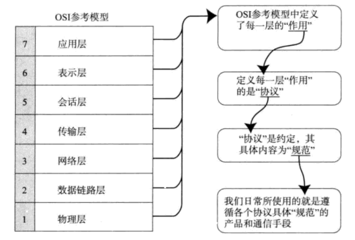
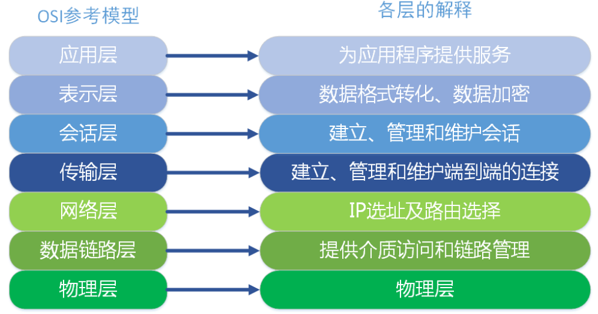

## TCP/IP模型
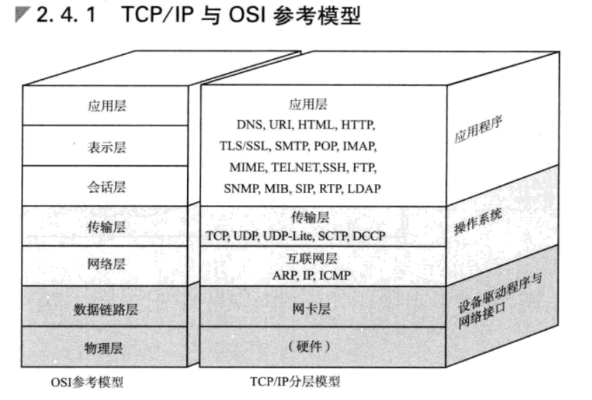
### 应用层
### 传输层
### 网络层
### 数据链路层
## IP协议
>相当于OSI中的网络层，主要作用是实现终端节点之间的通信。
### 路由控制
### 路由算法
### 路由控制表
>所有主机都维护一张路由控制表。该表记录IP数据在下一跳应该发送给哪个路由器。
### IP地址
>由网络和主机两部分标识组成
#### 分类
**ipv4**
- A类地址
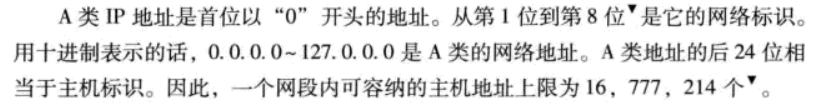
- B类地址
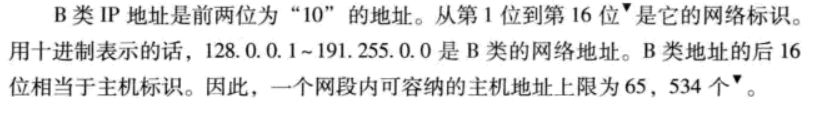
- C类地址
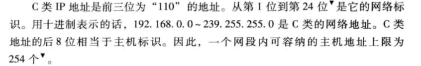
- D类地址
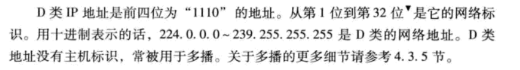
**ipv6**

### DNS
#### DNS系统的作用
>它可以维护一个用来表示组织内部主机名（域名）和IP地址之间对应关系的数据库
#### 域名的分层结构
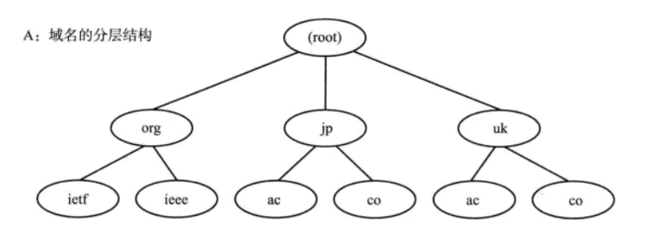
#### 解析器
>进行DNS查询的主机和软件叫做DNS解析器
#### DNS查询
>比如我现在需要访问贵公司的域名，那么首先会调用本机的域名解析器，域名解析器为了查询IP地址，会向域名服务器进行查询。
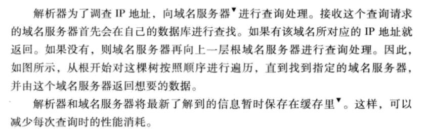
#### ARP的工作机制
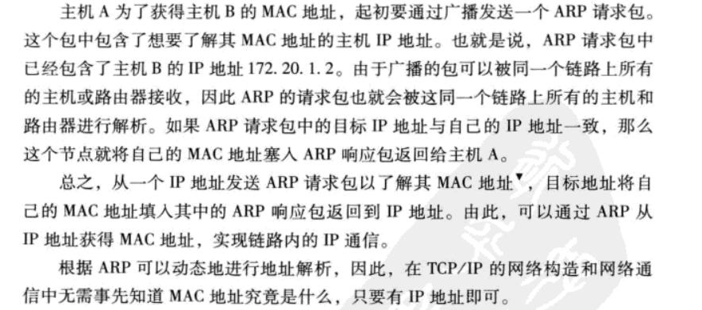

### ICMP
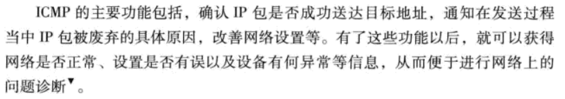

## TCP与UDP
### 传输层的作用
>让本机的端口与服务器的指定端口建立链接和断开链接。
### TCP
>TCP是面向链接的、可靠的流协议。
- 特点
1. 通过检验和、序列号、确认应答、重发控制、链接管理以及窗口控制等实现可靠性传输。
#### 序列号和确认应答号
#### 重发超时如何确定
#### 利用窗口控制提高速度
>确认应答不再是以每个分段，而是以更大的单位来进行确认。
##### 窗口
>无需等待确认应答而可以继续发送数据的最大值。同时添加缓冲区保留窗口中的数据。
##### 高速重发控制
#### 流控制
>TCP提供一种机制可以让发送端根据接收端的实际接受能力控制发送的数据量。具体实现就是接收端向发送端主机通知自己可以接受数据的大小。
#### 拥塞控制
>通信开始通过一个慢启动的算法得出的数值，对发送的数据进行控制。
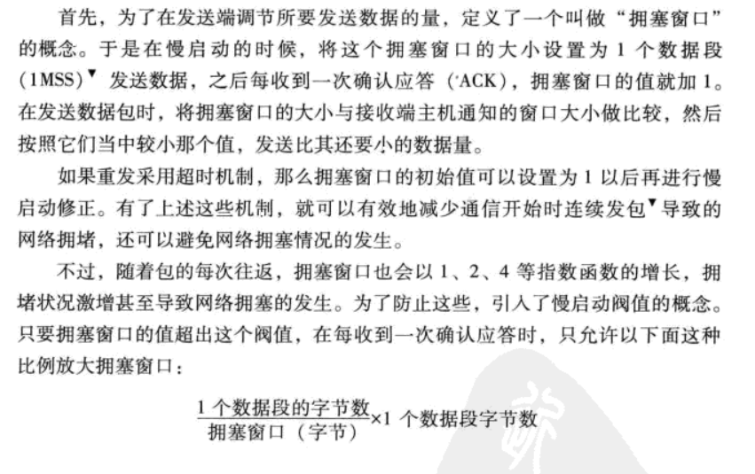
##### 慢启动阈值
>设置为超时重发时窗口大小的一半。

### UDP
>UDP是不具有可靠性的数据报协议。
#### UDP的特点和目的
- 特点
1. 面向无连接
2. 可以随时发送数据
3. UDP本身处理简单高效

- 使用场景
1. 包总量较少的通信DNS、SNMP
2. 视频、音频等多媒体通信
3. 广播通信

### TCP与UDP的使用场景区别
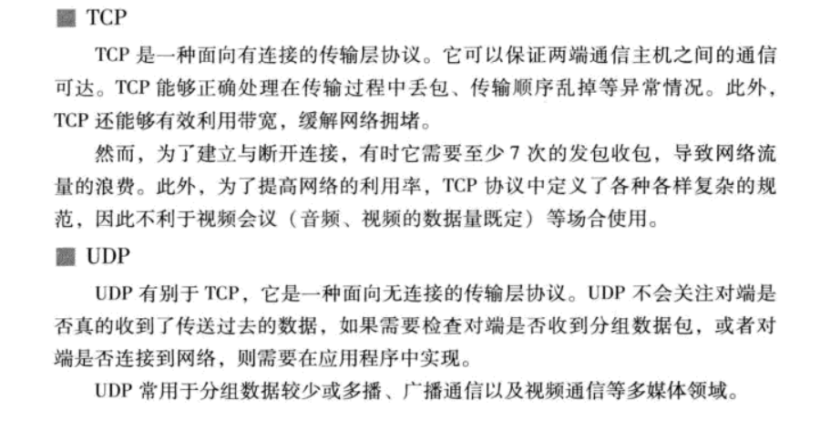
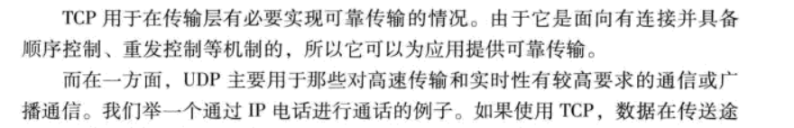

### 端口号与协议

### 提高网络利用率规范
#### Nagle算法
#### 延迟确认应答

## 路由控制
### 路由算法
#### 距离向量算法
#### 链路状态

## 应用层协议
### 远程登录-TELNET-23
- 概述
远程登录，它是Tnternet中用来进行远程访问的重要工具之一。远程登录功能允许用户与远程计算机进行动态交互，即用自己的键盘，鼠标等输入设备操纵远程计算机，运行远程计算机上的软件，在自己的显示器上了解运行情况，查看运行结果。
- 通信过程
用户的终端实际上与本地的TELNET客户机程序进行通信，远程主机与远程TELNET服务器进行通信。然后通过TCP进行连接， 客户机与服务器之间采用NVT标准进行通信。

1. 建立与服务器的TCP连接；
2. 从键盘上接收用户输入的字符；
3. 把用户输入的字符串变成标准格式并送给服务器；
4. 从远程服务器接收输出的信息；
5. 把该信息显示在用户的屏幕上。

### 文件传输-FTP-21
- 概述
文件传输协议，负责将文件从一台计算机传送到另一台计算机上，并且保证其传输的可靠性。
- 通信过程
客户端提出文件传输请求，服务器接收请求并提供服务。首先在本地计算机上启动FTP客户程序，利用他与远程计算机建立连接，远程计算机上的服务端FTP程序被激活。这样本地的FTP程序成为一个客户，而远程FTP程序成为服务器，他们之间通过TCP建立连接，端口号为21.

### 电子邮件-SMTP-25
- 概述
SMTP协议包括两个标准子集， 一个标准定义电子邮件信息的格式，另一个是传输邮件的标准。在互联网中，电子邮件的传送是依靠SMTP协议进行的。SMTP的主要任务是负责服务器之间的邮件传送，最大的特点是简单。只规定了电子邮件如何在互联网中通过TCP协议在发送方和接收方之间进行传送。

- 通信方式
基于客户/服务器方式进行的。发送人的主机为客户方，收件人的邮件服务器为服务方。在传送邮件的过程中，需要使用TCP协议进行连接（默认端口号为25）。发送主机先将邮件发送到本地SMTP服务器上，本地SMTP服务器与接收方的邮件服务器建立可靠的TCP连接，从而保证了邮件传输的可靠性

### 域名服务器-DNS-53
- 概述
用域名系统来处理IP地址和主机名之间的转换， 在DNS中主机名即为域名。
DNS也是一个应用层协议，为了提供主机名到IP地址的转换服务，DNS是运行在UDP协议之上，使用53号端口。
