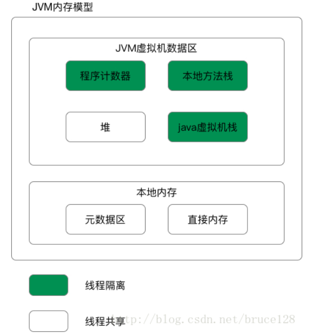

# JVM
>从软件层面屏蔽不同操作系统在底层硬件与指令上的区别
- JDK
- JRE
- JVM

# 程序运行过程

# Java虚拟机的组成
- 字节码执行引擎
- 类装载子系统
- 运行时数据区（内存模型）

# Java内存区的组成
* 程序计数器
* Java 虚拟机栈
* 本地方法栈
* 堆
* 方法区

## JDK1.8 内存模型

## 栈
>Java 虚拟机栈是描述 Java 方法运行过程的内存模型。
### 解释
Java 虚拟机栈会为每一个即将运行的 Java 方法创建一块叫做“栈帧”的区域，用于存放该方法运行过程中的一些信息，如：
* 局部变量表：存放局部变量的值或地址
* 操作数栈：一个以字长为单位的数组，用来是一种保存操作数的数据结构。进行操作时先将2个操作数压入栈中，运到操作符时，弹出栈顶的2个数然后计算结果并压入。
* 动态链接
* 方法出口信息：调用这个方法的位置的地址值
* ......

### 压栈出栈过程

当方法运行过程中需要创建局部变量时，就将局部变量的值存入栈帧中的局部变量表中。

Java 虚拟机栈的栈顶的栈帧是当前正在执行的活动栈，也就是当前正在执行的方法，PC 寄存器也会指向这个地址。只有这个活动的栈帧的本地变量可以被操作数栈使用，当在这个栈帧中调用另一个方法，与之对应的栈帧又会被创建，新创建的栈帧压入栈顶，变为当前的活动栈帧。

方法结束后，当前栈帧被移出，栈帧的返回值变成新的活动栈帧中操作数栈的一个操作数。如果没有返回值，那么新的活动栈帧中操作数栈的操作数没有变化。

> 由于Java 虚拟机栈是与线程对应的，数据不是线程共享的，因此不用关心数据一致性问题，也不会存在同步锁的问题。
>深入jvm指令，了解指令具体对应的操作过程，操作数栈具体如何实现运作。

### Java 虚拟机栈的特点

* 局部变量表随着栈帧的创建而创建，它的大小在编译时确定，创建时只需分配事先规定的大小即可。在方法运行过程中，局部变量表的大小不会发生改变。
* Java 虚拟机栈会出现两种异常：StackOverFlowError 和 OutOfMemoryError。
  * StackOverFlowError  若 Java 虚拟机栈的大小不允许动态扩展，那么当线程请求栈的深度(栈帧的数量)超过当前 Java 虚拟机栈的最大深度时，抛出 StackOverFlowError 异常。
  * OutOfMemoryError  若允许动态扩展，那么当线程请求栈时内存用完了，无法再动态扩展时，抛出 OutOfMemoryError 异常。
* Java 虚拟机栈也是线程私有，随着线程创建而创建，随着线程的结束而销毁。

> 出现 StackOverFlowError 时，内存空间可能还有很多。

## 本地方法栈（C 栈）

### 本地方法栈的定义

本地方法栈是为 JVM 运行 Native 方法准备的空间，由于很多 Native 方法都是用 C 语言实现的，所以它通常又叫 C 栈。它与 Java 虚拟机栈实现的功能类似，只不过本地方法栈是描述本地方法运行过程的内存模型。
>常见的本地方法，和作用。

### 栈帧变化过程

本地方法被执行时，在本地方法栈也会创建一块栈帧，用于存放该方法的局部变量表、操作数栈、动态链接、方法出口信息等。

方法执行结束后，相应的栈帧也会出栈，并释放内存空间。也会抛出 StackOverFlowError 和 OutOfMemoryError 异常。

> 如果 Java 虚拟机本身不支持 Native 方法，或是本身不依赖于传统栈，那么可以不提供本地方法栈。如果支持本地方法栈，那么这个栈一般会在线程创建的时候按线程分配。

## 程序计数器
### 定义
当前线程所执行字节码的行号指示器。

### 作用
- **字节码解释器**通过改变程序计数器来依次读取指令，从而实现代码的流程控制。
- 在多线程情况下，程序计数器记录的是当前线程执行的位置，从而当线程切换回来时，就知道上次线程执行到哪了。

### 特点
- 是一块较小的内存空间。
- 线程私有，每条线程都有自己的程序计数器。
- 生命周期：随着线程的创建而创建，随着线程的结束而销毁。
- 是唯一一个不会出现`OutOfMemoryError`的内存区域。

## 堆
>Java堆是被所有线程所共享的一块内存区域，目的是为了存放对象实例。
### 特点
- 线程共享
- 垃圾回收的主要场所
- 不同区域存放不同生命周期的对象，这样可以根据不同的区域使用不同的垃圾回收算法。
>Java堆使用的内存区域可以不连续。`区分逻辑内存和物理内存`。

## 方法区
>用于存储已被虚拟机加载的类信息、常量、静态变量、即时编译器编译后的代码等数据。
### 运行时常量池
>用于存放编译期生成的各种字面量和符号引用。常量放运行时常量池，方法区中放：类信息，常量，静态变量，即时编译器编译后的代码。
### 直接内存(堆外内存)
>直接内存是除Java之外的内存，但也可能被Java使用。
#### 操作直接内存
在NIO中引入了一种基于通道和缓冲的IO方式。它可以通过调用本地方法直接分配Java虚拟机之外的内存，然后通过一个存储在堆中的`DirectByteBuffer`对象直接操作该内存，而无需先将外部内存中的数据复制到堆中再进行操作，从而提高数据操作的效率。
>在NIO中需要对内存分配进行更加深入的了解。
#### 直接内存与堆内存比较
- 直接内存申请空间耗费更高的性能
- 直接内存读取IO的性能优于普通内存。
- 直接内存作用链：本地IO -》直接内存 -》本地IO
- 堆内存作用链：本地IO -》直接内存 -》非直接内存 -》直接内存 -》本地IO

## 年轻代

年轻代用来存放新近创建的对象，尺寸随堆大小的增大和减小而相应的变化，默认值是保持为堆大小的1/15，可以通过 -Xmn 参数设置年轻代为固定大小，也可以通过 -XX:NewRatio 来设置年轻代与年老代的大小比例，年青代的特点是对象更新速度快，在短时间内产生大量的“死亡对象”。

年轻代的特点是产生大量的死亡对象,并且要是产生连续可用的空间, 所以使用复制清除算法和并行收集器进行垃圾回收.对年轻代的垃圾回收称作初级回收 (minor gc)。

初级回收将年轻代分为三个区域, 一个新生代 , 2个大小相同的复活代, 应用程序只能使用一个新生代和一个复活代, 当发生初级垃圾回收的时候,gc挂起程序, 然后将新生代和复活代中的存活对象复制到另外一个非活动的复活代中,然后一次性清除新生代和复活代，将原来的非复活代标记成为活动复活代。将在指定次数回收后仍然存在的对象移动到老年代中，初级回收后，得到一个空的可用的新生代。

新生代几乎是所有 Java 对象出生的地方，即 Java 对象申请的内存以及存放都是在这个地方。Java 中的大部分对象通常不需长久存活，具有朝生夕灭的性质。 当一个对象被判定为 “死亡” 的时候，GC 就有责任来回收掉这部分对象的内存空间。新生代是 GC 收集垃圾的频繁区域。 当对象在 Eden 出生后，在经过一次 Minor GC 后，如果对象还存活，并且能够被另外一块 Survivor 区域所容纳，则使用复制算法将这些仍然还存活的对象复制到另外一块 Survivor 区域中，然后清理所使用过的 Eden 以及 Survivor 区域，并且将这些对象的年龄设置为1，以后对象在 Survivor 区每熬过一次 Minor GC，就将对象的年龄 + 1，当对象的年龄达到某个值时 ( 默认是 15 岁，可以通过参数 -XX:MaxTenuringThreshold 来设定 )，这些对象就会成为老年代。 但这也不是一定的，对于一些较大的对象 ( 即需要分配一块较大的连续内存空间 ) 则是直接进入到老年代。

## 老年代
Full GC 是发生在老年代的垃圾收集动作，所采用的是标记-清除算法。

现实的生活中，老年代的人通常会比新生代的人 “早死”。堆内存中的老年代(Old)不同于这个，老年代里面的对象几乎个个都是在 Survivor 区域中熬过来的，它们是不会那么容易就 “死掉” 了的。因此，Full GC 发生的次数不会有 Minor GC 那么频繁，并且做一次 Full GC 要比进行一次 Minor GC 的时间更长。 另外，标记-清除算法收集垃圾的时候会产生许多的内存碎片 ( 即不连续的内存空间 )，此后需要为较大的对象分配内存空间时，若无法找到足够的连续的内存空间，就会提前触发一次 GC 的收集动作

## 永久代 PermGen
> “PermGen space”其实指的就是方法区。
由于方法区主要存储类的相关信息，所以对于动态生成类的情况比较容易出现永久代的内存溢出。最典型的场景就是，在 jsp 页面比较多的情况，容易出现永久代内存溢出。

## 元空间 Metaspace
元空间的本质和永久代类似，都是对JVM规范中方法区的实现。不过元空间与永久代之间最大的区别在于：元空间并不在虚拟机中，而是使用本地内存。因此，默认情况下，元空间的大小仅受本地内存限制，但可以通过以下参数来指定元空间的大小：
- XX:MetaspaceSize，初始空间大小，达到该值就会触发垃圾收集进行类型卸载，同时GC会对该值进行调整：如果释放了大量的空间，就适当降低该值；如果释放了很少的空间，那么在不超过MaxMetaspaceSize时，适当提高该值。
- XX:MaxMetaspaceSize，最大空间，默认是没有限制的。
除了上面两个指定大小的选项以外，还有两个与 GC 相关的属性：
- XX:MinMetaspaceFreeRatio，在GC之后，最小的Metaspace剩余空间容量的百分比，减少为分配空间所导致的垃圾收集
- XX:MaxMetaspaceFreeRatio，在GC之后，最大的Metaspace剩余空间容量的百分比，减少为释放空间所导致的垃圾收集

### 永久代向元空间转换的原因
1. 字符串存在永久代中，容易出现性能问题和内存溢出。
2. 类及方法的信息等比较难确定其大小，因此对于永久代的大小指定比较困难，太小容易出现永久代溢出，太大则容易导致老年代溢出。
3. 永久代会为 GC 带来不必要的复杂度，并且回收效率偏低。

## 参考文献
[永久代和元空间](https://www.cnblogs.com/paddix/p/5309550.html)
[JVM内存溢出和合理分配](https://blog.csdn.net/ye1992/article/details/9344807)