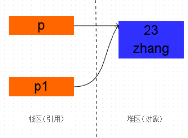
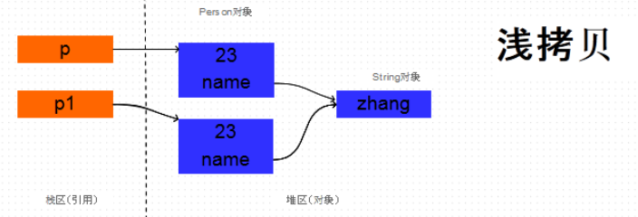
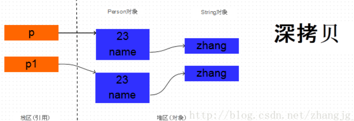
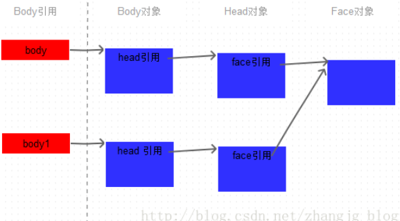

# Object 类
Object类是所有Java类的根父类。

如果一个类没有显示地继承某个类，那么这个类会默认继承Object类。

Object类有一个空参构造器。

Object类中有12个方法， 其中 1 个 private，2 个protected，9 个 public；6 个 final 方法；7 个 native 方法；有三个重载方法wait方法。 finalize 方法由 GC 在清理对象前调用一次，可以看作析构函数。

```
public class Object {

    private static native void registerNatives();
    static {
        registerNatives();
    }

    public String toString() {
        return getClass().getName() + "@" + Integer.toHexString(hashCode());
    }

    public boolean equals(Object obj) {
        return (this == obj);
    }
        
    protected void finalize() throws Throwable {
    }
    
    protected native Object clone() throws CloneNotSupportedException;
    public native int hashCode();
    
    public final native Class<?> getClass();
    
    public final native void notify();
    public final native void notifyAll();
    
    public final void wait() throws InterruptedException {
        wait(0);
    }
    public final void wait(long timeout, int nanos) throws InterruptedException {
        if (timeout < 0) {
            throw new IllegalArgumentException("timeout value is negative");
        }

        if (nanos < 0 || nanos > 999999) {
            throw new IllegalArgumentException(
                "nanosecond timeout value out of range");
        }

        if (nanos > 0) {
            timeout++;
        }

        wait(timeout);
    }
    public final native void wait(long timeout) throws InterruptedException;
}
```

## equals方法
equals()方法需要具有如下特点：

- 自反性（reflexive）：**任何非空引用x，x.equals(x)返回为true。

- 对称性（symmetric）：**任何非空引用x和y，x.equals(y)返回true当且仅当y.equals(x)返回true。

- 传递性（transitive）：**任何非空引用x和y，如果x.equals(y)返回true，并且y.equals(z)返回true，那么x.equals(z)返回true。

- 一致性（consistent）：**两个非空引用x和y，x.equals(y)的多次调用应该保持一致的结果，（前提条件是在多次比较之间没有修改x和y用于比较的相关信息）。

**约定**：对于任何非空引用x，x.equals(null)应该返回为false。并且覆写equals()方法时，应该同时覆写hashCode()方法，反之亦然。

**面试题**==与equals的区别。​ 答：​ == : 如果比较的是基本数据类型，那么比较的是变量的值（存在自动类型提升）。如果比较的是引用数据类型，那么比较的也是变量的值（地址值），即比较两个引用是否指向同一个对象。​ equals : 是一个方法，可以被重写。在Object类中等同于==。像String、Date等类都重写了equls方法，用来比较内容。

Object类的equals方法比较两个引用所指向的是不是同一个对象。

String类重写了该方法：比较字符串的内容是否相同。
```
public boolean equals(Object anObject) {
    if (this == anObject) {
        return true;
    }
    if (anObject instanceof String) {
        String anotherString = (String)anObject;
        int n = value.length;
        if (n == anotherString.value.length) {
            char v1[] = value;
            char v2[] = anotherString.value;
            int i = 0;
            while (n-- != 0) {
                if (v1[i] != v2[i])
                    return false;
                i++;
            }
            return true;
        }
    }
    return false;
}
```

## hashCode方法
这个方法返回一个整型值（hash code value），如果两个对象被equals()方法判断为相等，那么它们就应该拥有同样的 hash code。

Object类的hashCode()方法为不同的对象返回不同的值，Object类的hashCode值表示的是对象的地址。

## toString方法
输出一个引用时，实际上是先默认调用了toString方法得到一个字符串，然后调用重载方法public void System.out.println(String x)。

## clone方法
1. 重写clone方法的类必须实现 java.lang.Cloneable 接口，否则会抛出CloneNotSupportedException异常。Cloneable接口中不包含任何方法，所以实现它时只要在类声明中加上implements语句即可。
2. 这个方法是protected修饰的，覆写clone()方法的时候需要写成public，才能让类外部的代码调用。
- p1 = p 引用赋值，两个引用指向同一对象。

- p1 = (Person) p.clone()，clone是浅拷贝的

```
@Override
protected Object clone() throws CloneNotSupportedException {
    return super.clone();
}
```
- 深拷贝

```
@Override
protected Object clone() throws CloneNotSupportedException {
    User user = (User)super.clone();
    user.teacher = (Teacher) this.teacher.clone();
    return user;
}
```
- 不彻底的深拷贝
