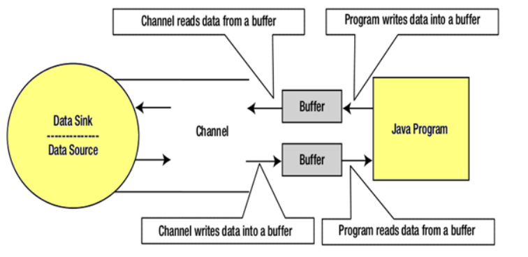

# NIO
>Java提供了一个叫作NIO(New I/O)的第二个I/O系统，NIO提供了与标准I/O API不同的I/O处理方式。

## 基本组成
- 通道和缓冲区(Channels and Buffers)：在标准I/O API中，使用字符流和字节流。 在NIO中，使用通道和缓冲区。数据总是从缓冲区写入通道，并从通道读取到缓冲区。

- 选择器(Selectors)：Java NIO提供了“选择器”的概念。这是一个可以用于监视多个通道的对象，如数据到达，连接打开等。因此，单线程可以监视多个通道中的数据。

- 非阻塞I/O(Non-blocking I/O)：Java NIO提供非阻塞I/O的功能。这里应用程序立即返回任何可用的数据，应用程序应该具有池化机制，以查明是否有更多数据准备就绪。

## 读写过程

### 通道和缓冲区
>在Java中，NIO读写是I/O的基本过程。 从通道读取：创建一个缓冲区，然后请求通道读取数据。通道写入：创建一个缓冲区，填充数据，并要求通道写入数据。

核心组件：
- Channels
- Buffers
- Selectors
#### 主要通道
1. DatagramChannel
2. SocketChannel
3. FileChannel
4. ServerSocketChannel
#### 缓冲列表
1. CharBuffer
2. DoubleBuffer
3. IntBuffer
4. LongBuffer
5. ByteBuffer
6. ShortBuffer
7. FloatBuffer
#### 选择器
>Java NIO提供了“选择器”的概念。这是一个可以用于监视多个通道的对象，如数据到达，连接打开等。因此，单线程可以监视多个通道中的数据。

## IO与NIO
### 阻塞IO
阻塞IO等待数据写入或返回前的读取。Java IO的各种流是阻塞的。这意味着当线程调用`write()`或`read()`时，线程会被阻塞，直到有一些数据可用于读取或数据被完全写入。

### 非阻塞IO
非阻塞IO不等待返回前读取或写入数据。 Java NIO非阻塞模式允许线程请求向通道写入数据，但不等待它被完全写入。允许线程继续进行，并做其他事情。

### 面向流和面向缓冲
Java IO是面向流的I/O，这意味着我们需要从流中读取一个或多个字节。它使用流来在数据源/槽和java程序之间传输数据。使用此方法的I/O操作较慢。
#### 面向流
Java IO是面向流的I/O，这意味着我们需要从流中读取一个或多个字节。它使用流来在数据源/槽和java程序之间传输数据。使用此方法的I/O操作较慢。
#### 面向缓冲
Java NIO是面向缓存的I/O方法。 将数据读入缓冲器，使用通道进一步处理数据。 在NIO中，使用通道和缓冲区来处理I/O操作。
通道和流的区别：
- 流可以用于单向数据传输。
- 通道提供双向数据传输。

### 通道
在Java NIO中，通道是在实体和字节缓冲区之间有效传输数据的媒介。 它从一个实体读取数据，并将其放在缓冲区块中以供消费。

### 选择器(Selectors)
在Java NIO中，选择器是可选择通道的多路复用器，可用作可以进入非阻塞模式的特殊类型的通道。它可以检查一个或多个NIO通道，并确定哪个通道准备好进行通信，即读取或写入。
作用：
- 选择器用于使用单个线程处理多个通道。因此，它需要较少的线程来处理这些通道。
- 线程之间的切换对于操作系统来说是昂贵的。 因此，为了提高系统效率选择器是有用的。

