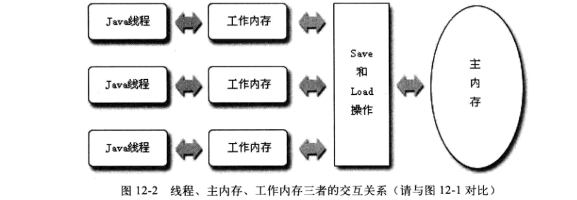
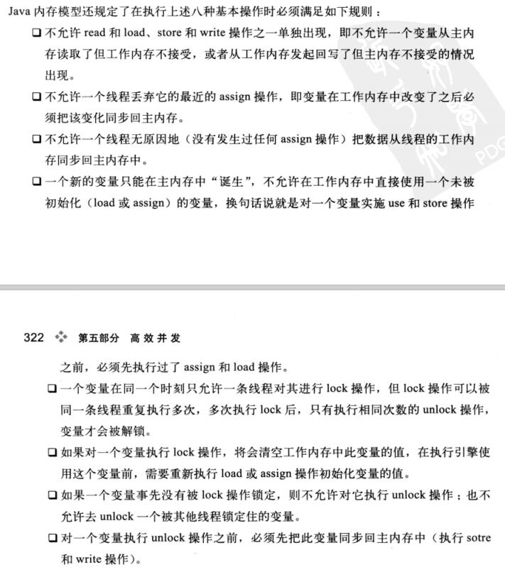
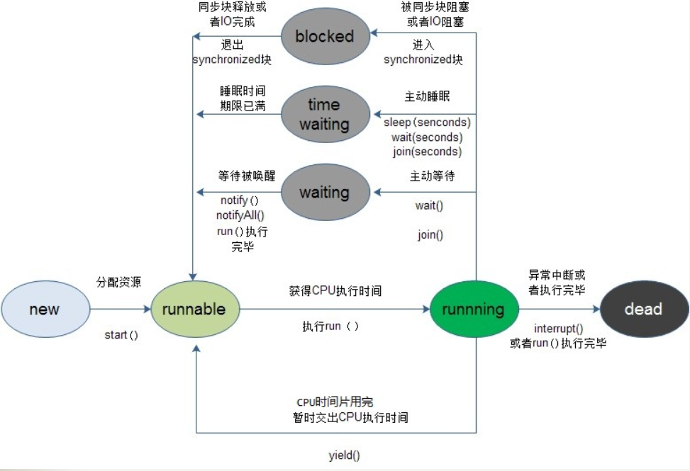

# Java内存模型

## 设立目标
定义程序中各个变量的访问规则，即在虚拟机中将变量存储到内存和从内存中取出变量这样的底层细节。此处的变量（Variable）与Java编程中的变量略有区别，它包括实例变量/静态字段和构成数组对象的元素，不包括局部变量和方法参数（线程私有）。为获得较好的执行效能，Java内存模型并没有限制执行引擎使用处理器的特定寄存器或缓存来和主内存进行交换，也没有限制即时编译器调整代码执行顺序这类权利。
>编译器调整代码执行顺序==重排序问题，那么具体怎么调整？调整哪些？目的是什么？

## 主存和工作内存
Java内存模型规定所有变量都存储在主存（Main Memory）中（虚拟机内存的一部分）。每条线程还有自己的工作内存（Working Memory），线程的工作内存保存了被线程使用到的变量的主内存副本拷贝，线程对变量的所有操作（读取/赋值等）都必须在工作内存中进行，而不能直接读写主内存中的变量。不同线程之间也无法直接访问对方工作内存中的变量，线程间变量值的传递均需要通过主存来完成。

## 内存间交互操作
>主内存与工作内存之间具体的交互协议，即一个变量如何从主内存拷贝到工作内存、从工作内存同步回主内存之类的实现细节。
内存操作：
1. Lock（锁定）：作用于主内存的变量，将主内存该变量标记成当前线程私有的，其他线程无法访问它把一个变量标识为一条线程独占的状态。
2. Unlock（解锁）：作用于主内存的变量，把一个处于锁定状态的变量释放出来，才能被其他线程锁定。
3. Read（读取）：作用于主内存的变量，把一个变量的值从主内存传输到线程的工作内存中，以便随后的load动作使用。
4. Load（加载）：作用于工作内存中的变量，把read操作从内存中得到的变量值放入工作内存的变量副本中。
5. Use（使用）：作用于工作内存中的变量，把工作内存中一个变量的值传递给执行引擎，每当虚拟机遇到一个需要使用到变量的值的字节码指令时将会执行这个操作。
6. Assgin（赋值）：作用于工作内存中的变量，把一个从执行引擎接收到的值赋值给工作内存的变量，每当虚拟机遇到一个给变量赋值的字节码指令时执行这个操作。
7. Store（存储）：作用于工作内存中的变量，把工作内存中一个变量的值传递到主内存中，以便随后的write操作使用。
8. Write（写入）：作用于主内存中的变量，把store操作从工作内存中得到的变量的值放入主内存的变量中。

具体规则图下：

## volatile型变量及其规则
>Java语言提供了一种稍弱的同步机制，即volatile变量，用来确保将变量的更新操作通知到其他线程。当把变量声明为volatile类型后，编译器与运行时都会注意到这个变量是共享的，因此不会将该变量上的操作与其他内存操作一起重排序。volatile变量不会被缓存在寄存器或者对其他处理器不可见的地方，因此在读取volatile类型的变量时总会返回最新写入的值。

### 特点
1. 保证此变量对所有的线程的可见性，这里的“可见性”，如本文开头所述，当一个线程修改了这个变量的值，volatile 保证了新值能立即同步到主内存，以及每次使用前立即从主内存刷新。但普通变量做不到这点，普通变量的值在线程间传递均需要通过主内存（详见：Java内存模型）来完成。

2. 禁止指令重排序优化。有volatile修饰的变量，赋值后多执行了一个“load addl $0x0, (%esp)”操作，这个操作相当于一个内存屏障（指令重排序时不能把后面的指令重排序到内存屏障之前的位置），只有一个CPU访问内存时，并不需要内存屏障；（什么是指令重排序：是指CPU采用了允许将多条指令不按程序规定的顺序分开发送给各相应电路单元处理）。
### 区别
1. 当对非 volatile 变量进行读写的时候，每个线程先从内存拷贝变量到CPU缓存中。如果计算机有多个CPU，每个线程可能在不同的CPU上被处理，这意味着每个线程可以拷贝到不同的 CPU cache 中。
2. 而声明变量是 volatile 的，JVM 保证了每次读变量都从内存中读，跳过 CPU cache 这一步。

### 使用规则
1. 运算结果并不依赖当前值，或者能够确保只有单一的线程修改变量的值。
2. 变量不需要与其他的状态变量共同参与不变约束。？怎么理解。
>重排序问题是否就是编译器调整代码的执行顺序问题。

## 原子性、可见性、有序性
1. 原子性（Atomicity）：由Java内存模型来直接保证的原子性变量操作包括read、load、assign、use、store和write，我们大致可以认为基本数据类型的访问具备原子性（long和double例外）。
2. 可见性：指当一个线程修改了共享变量的值，其他线程能够立即得知这个修改。（synchronized和final）
3. 有序性（Ordering）：Java程序中天然的有序性可以总结为一句话：如果在本线程内观察，所有的操作都是有序的；如果在一个线程中观察另外一个线程，所有的操作都是无序的。前半句是指“线程内表现为串行的语义”（Within-Thread As-if-Serial Semantics），后半句是指“指令重排序”现象和“工作内存与主内存同步延迟”现象。
Java语言提供了volatile和synchronized两个关键字来保证线程之间操作的有序性，volatile关键字本身就包含了禁止指令重排序的语义，而synchronized则是由“一个变量在同一时刻只允许一条线程对其进行lock操作”这条规则获得的，这个规则决定了持有同一个锁的两个同步块只能串行地进入。

## 先行发生原则
>如果操作A先行发生于操作B，其实就是说在发生操作B之前，操作A产生的影响能被操作B观察到，“影响”包括修改了内存中共享变量的值/发送了消息/调用了方法等。

1）程序次序规则（Program Order Rule）：在一个线程内，按照程序代码顺序，书写在前面的操作先行发生于书写在后面的操作。准确地来说应该是控制流顺序而不是程序代码顺序，因为要考虑分支/循环结构。

2）管程锁定规则（Monitor Lock Rule）：一个unlock操作先行发生于后面对同一锁的lock操作。这里必须强调的是同一锁，而“后面”是指时间上的先后顺序。

3）volatile变量规则（Volatile Variable Rule）：对一个volatile变量的写操作先行发生于后面对这个变量的读操作，这里的“后面”是指时间上的先后顺序。

4）线程启动规则（Thread Start Rule）：Thread对象的start()方法先行发生于此线程的每一个动作。

5）线程终止规则（Thread Termination Rule）：线程中的所有操作都先行发生于对此线程的终止检测，我们可以通过Thread.join()方法结束/Thread.isAlive()的返回值等手段检测到县城已经终止执行。

6）线程中断规则（Thread Interruption Rule）：对线程interrupt()方法的调用先行发生于被中断线程的代码检测到中断事件的发生，可以通过Thread.interrupted()方法检测到是否有中断发生。

7）对象终结规则（Finalizer Rule）：一个对象的初始化完成（构造函数执行结束）先行发生于它的finalize()方法的开始。

8）传递性（Transitivity）：如果操作A先行发生于操作B，操作B先行发生于操作C，那么操作A先行发生于操作C。
>时间上的先后顺序与先行发生原则之间基本没有太大的关系，所以我们衡量并发安全问题时不要受时间顺序的干扰，一切必须以先行发生原则为准。
>对于volatile变量如果同一时刻有大量的写和读请求怎么处理？

## Java线程调度
- 协同调度
- 抢占调用

1. 新建（New）：创建尚未启动的线程处于这种状态。
2. 运行（Runable）：包括操作系统线程状态中的Running和Ready，处于此状态的线程可能正在运行，也可能等待着CPU为它分配执行时间。
3. 无限期等待（Waiting）：处于这种状态的线程不会被分配CPU执行时间，它们要等待其他线程显示地唤醒。
4. 限期等待（Timed Waiting）：处于这种状态的线程也不会被分配CPU执行时间，不过无须等待被其他线程显示地唤醒，在一定时间后由系统自动唤醒。
5. 阻塞（Blocked）：线程被阻塞了，“阻塞状态”与“等待状态”的区别是：“阻塞状态”在等待获取一个排它锁，这个事件将在另外一个线程放弃这个锁的时候发生；“等待状态”则是在等待一段时间，或者唤醒动作的发生。在程序进入等待进入同步块区域的时候，线程将进入这种状态。
6. 结束（Terminated）：已终止线程的线程状态，线程已经结束执行。