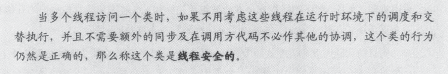

# 线程安全
定义：无论何时，只要多于一个线程访问给定的状态变量。而且其中某个线程会写入该变量，此时必须使用同步来协助线程对该变量的访问。
线程安全是指多个线程在访问一个类时，如果不需要额外的同步，这个类的行为仍然是正确的。


## 线程安全的情况
线程安全的实例：
1. 一个无状态的类是线程安全的。
     无状态类是指不包含任何域或也没有引用其它类的域。一次特定计算的瞬间状态，会唯一存在本地变量中。
2. 原子操作是线程安全的。
     自增操作时一个离散操作的简写形式，获取当前值，加一，写回新值。这是一个读-改-写操作，不具备原子性。
3. 竞争条件是不安全的。
     当计算的正确性依赖于运行时相关的时序或者多线程的交替时，会产生竞争条件。最常见的一种是检查再运行(check-then-act)。

## 原子操作和复合操作
>单独的、不可分割的操作
- 不是原子操作例如i++（读-改-写的操作），容易遗失更新。 
- 下面惰性初始化的例子
```
public class Instance() {
     private Instance in = null;
     public Instance getInstance() {
          if(in == null) {
              in= new Instance();
          }
          return in;
     }
}
```
这个例子意图是想得到一个单例的对象，但是如果两个线程同时执行到getInstance()这个地方，此时此刻，in是否为null,这依赖于时序。这是无法预测到的。
解决检查再运行和读-改-写操作导致的线程不安全方法，就是必须保证操作的原子性。而java 内置的原子性机制-锁可以解决这些个问题。
>类加载过程的cinit类初始化静态变量和静态代码块，区别于对象初始化。

## 原子变量
>concurrent.atomic包中包括了`原子变量`类，确保所有访问该类型变量的操作都是原子操作。
