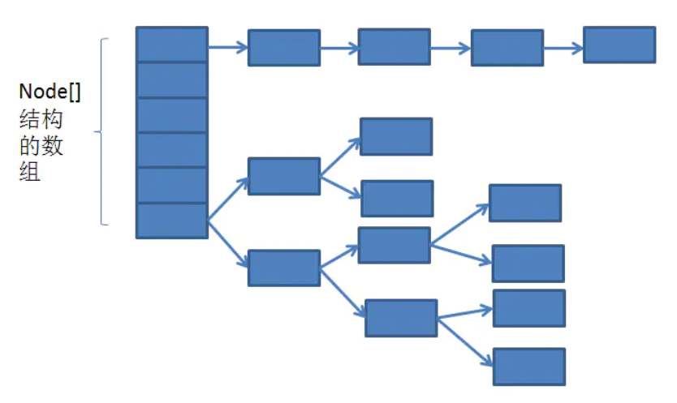
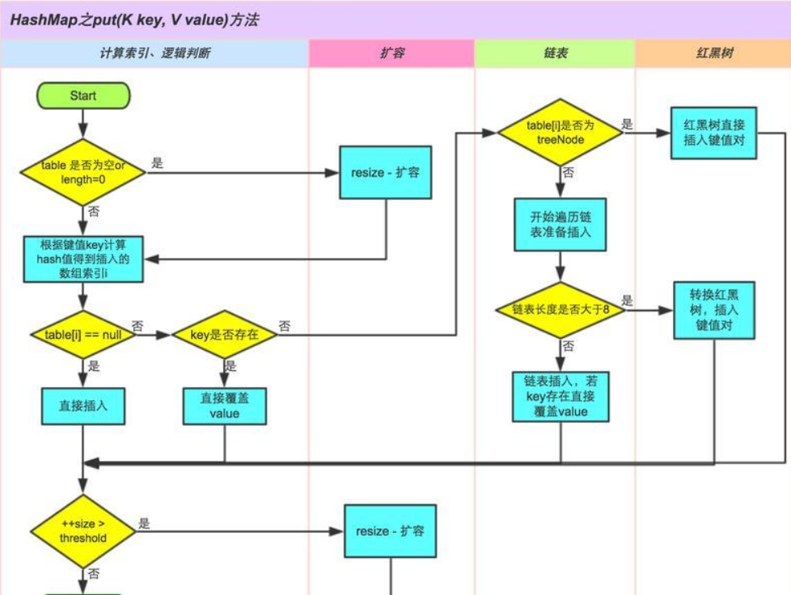
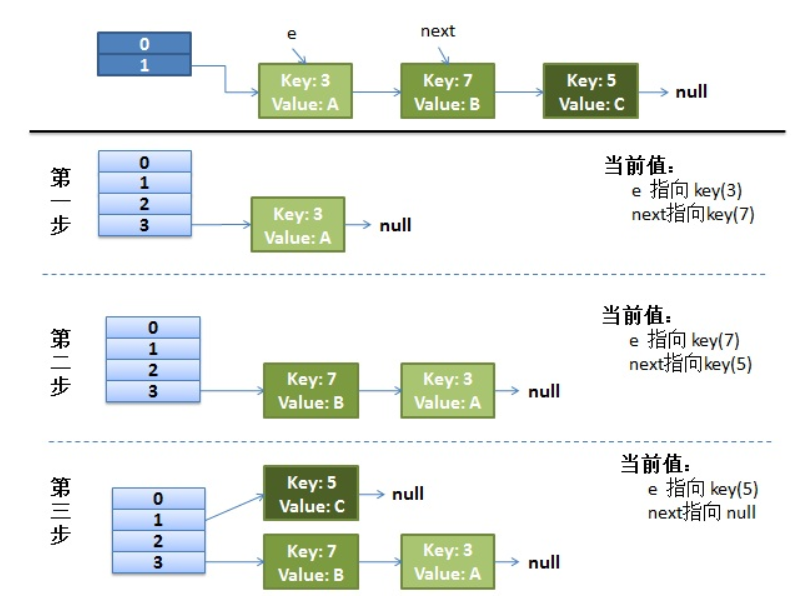
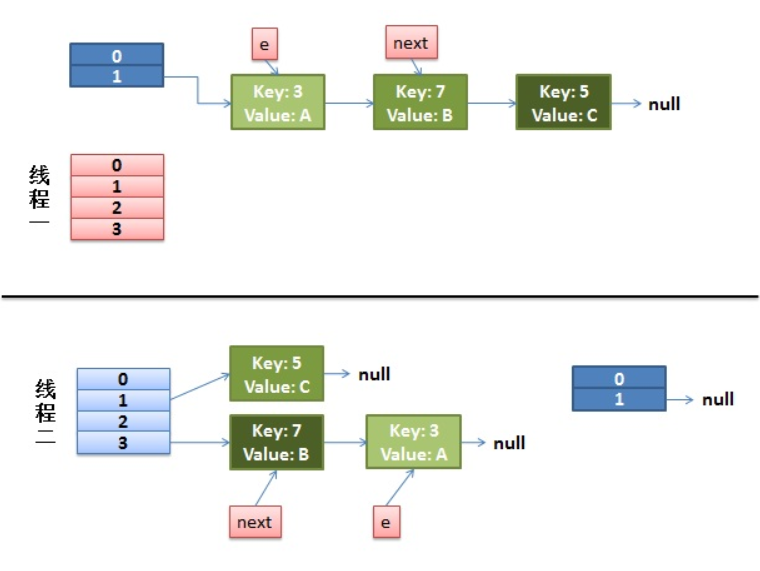
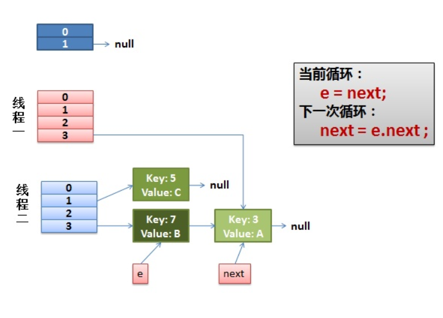
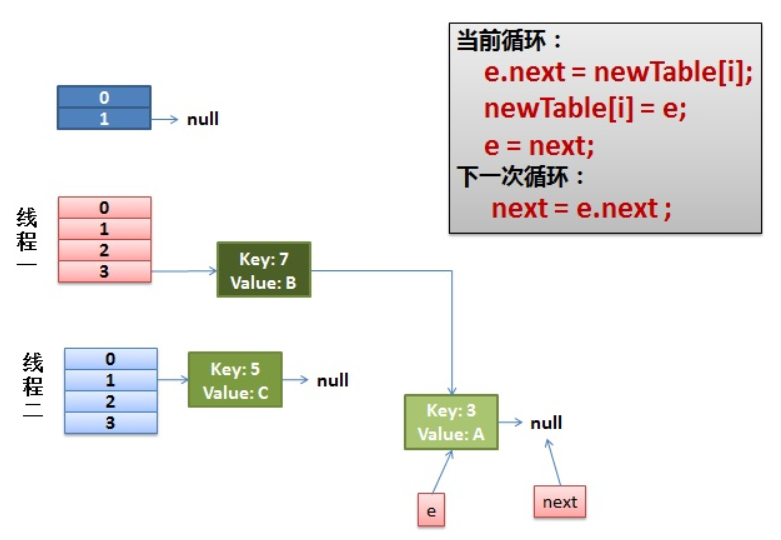
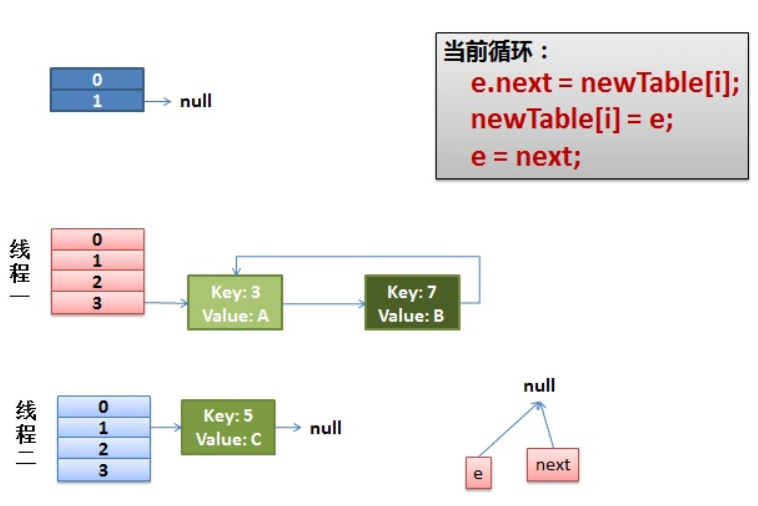

# HashMap

## HashCode方法
### 使用背景
>当向集合中插入对象时，如何判别在集合中是否已经存在该对象了？（注意：集合中不允许重复的元素存在）

```
也许大多数人都会想到调用equals方法来逐个进行比较，这个方法确实可行。但是如果集合中已经存在一万条数据或者更多的数据，如果采用equals方法去逐一比较，效率必然是一个问题。此时hashCode方法的作用就体现出来了，当集合要添加新的对象时，先调用这个对象的hashCode方法，得到对应的hashcode值，实际上在HashMap的具体实现中会用一个table保存已经存进去的对象的hashcode值，如果table中没有该hashcode值，它就可以直接存进去，不用再进行任何比较了；如果存在该hashcode值， 就调用它的equals方法与新元素进行比较，相同的话就不存了，不相同就散列其它的地址，所以这里存在一个冲突解决的问题，这样一来实际调用equals方法的次数就大大降低了，说通俗一点：Java中的hashCode方法就是根据一定的规则将与对象相关的信息（比如对象的存储地址，对象的字段等）映射成一个数值，这个数值称作为散列值。
```

### 与equal的联系
1. equal与==：==比较规则是，基本类型直接比较其在内存中的值，如果是引用类型则直接比较其引用对象的地址值。而equal则不同，equal是java提供给程序员自己比较直接创建出来的对象是否相等。
2. String对象的equal源码
```
## 源码中首先比较俩个对象的地址是否相等，如果相等那么必定 一样。
## 接着通过instabceof判断另外一个对象是否是String类的实例，
## 如果是同一个类的实例，那么将这俩个String对象转化为字符串数组。具体比较其内容是否一致。
public boolean equals(Object anObject) {
    if (this == anObject) {	//先比较两个字符串的引用是否相等(是否指向同一个对象), 是直接返回true
        return true;
    }
    if (anObject instanceof String) {	//两个引用不等还会继续比较
        String anotherString = (String)anObject;
        int n = value.length;
        if (n == anotherString.value.length) {
            char v1[] = value;	//字符串类是用字符数组实现的, 先要拿到两个字符串的字符数组
            char v2[] = anotherString.value;
            int i = 0;
            while (n-- != 0) {	//然后对两个数组逐个字符地进行比较
                if (v1[i] != v2[i])
                    return false;
                i++;
            }
            return true;
        }
    }
    return false;
}
```
3. 为什么重写equal必须重写hashcode？
>当我们往HashMap中插入2个对象Person1和Person2时如果这两个对象的属性完全相等，默认是相等的对象。但是HashCode依赖于对象的地址值，这个时候HashMap就会将这2个对象都存入进来，不符合原意。

## HashMap的基本属性
```
//默认的初始化容量为16
static final int DEFAULT_INITIAL_CAPACITY = 1 << 4;

//最大的容量，容量的值必须是2的幂并且小于最大的容量，最大值为2的30次方
static final int MAXIMUM_CAPACITY = 1 << 30;

//加载因子默认值为0.75
static final float DEFAULT_LOAD_FACTOR = 0.75f;

//计数阈值，超过这个值将会使用树形结构替代链表结构
static final int TREEIFY_THRESHOLD = 8;

//由树形结构转换成链表的阈值
static final int UNTREEIFY_THRESHOLD = 6;

//树形结构最小的容量为64
static final int MIN_TREEIFY_CAPACITY = 64;

//链表数组
transient Node<K,V>[] table;

//HashMap中value的集合
transient Set<Map.Entry<K,V>> entrySet;

//HashMap的长度
transient int size;

//调整大小的下一个大小值
int threshold;

//hashtable的加载因子
final float loadFactor;
```

## HashMap的内部结构


## HashMap功能的具体实现
```
public V put(K key, V value) {
    return putVal(hash(key), key, value, false, true);
}
/**
 * hash:为hash值
 * key:保存的key
 * value:保存的value
 * onlyIfAbsent:如果为true,不改变已经存在的值
 * evict:如果为false,表示table处于创造模式
**/
final V putVal(int hash, K key, V value, boolean onlyIfAbsent,
               boolean evict) {
    Node<K,V>[] tab; Node<K,V> p; int n, i;
    //判断table是否为空或者长度为0，若是则调用resize()新建数组
    if ((tab = table) == null || (n = tab.length) == 0)
        n = (tab = resize()).length;
    //然后定位当前需要保存的值在数组中位置，如果没有冲突，即当前位置上没有值则新增节点并将其添加
    if ((p = tab[i = (n - 1) & hash]) == null)
      //这里当hash=0时，即key值为空时，该值将会保存在tab[0]的位置
        tab[i] = newNode(hash, key, value, null);
    else {
        Node<K,V> e; K k;
        //判断是否为新增的元素是否为第一个元素(hash与key去判断)，如果是则获取第一个元素
        if (p.hash == hash &&
            ((k = p.key) == key || (key != null && key.equals(k))))
            e = p;
        // 判断是否为树形节点，如果是则新增一个树形节点
        else if (p instanceof TreeNode)
            e = ((TreeNode<K,V>)p).putTreeVal(this, tab, hash, key, value);
        else {
        // 是链表节点
            for (int binCount = 0; ; ++binCount) {
                //循环查找，直到链表末尾，添加新节点
                if ((e = p.next) == null) {
                    p.next = newNode(hash, key, value, null);
                    //如果大于设定的阈值8，则将链表转换为树形结构
                    if (binCount >= TREEIFY_THRESHOLD - 1) // -1 for 1st
                        treeifyBin(tab, hash);
                    break;
                }
                // 如果hash与key相等 则终止循环
                if (e.hash == hash &&
                    ((k = e.key) == key || (key != null && key.equals(k))))
                    break;
                // 节点的引用向后移动
                p = e;
            }
        }
        // 存在key对应的value时，按照条件替换并返回旧值
        if (e != null) { // existing mapping for key
            V oldValue = e.value;
            if (!onlyIfAbsent || oldValue == null)
                e.value = value;
            afterNodeAccess(e);
            return oldValue;
        }
    }
    ++modCount;
    if (++size > threshold)
        resize();
    afterNodeInsertion(evict);
    return null;
}
```
具体步骤分析：
1. **定位（Hash算法）**：首先计算出key对应的hash值，在将(tab.length()-1) & hash方式定位出当前添加的key-value在Node<K,V>[] tab中的索引位置(其实这里有个问题，就是为啥(tab.length()-1) & hash这种方式能保证分配的相对均匀，由于tab.length()是2的n次方的,
>(tab.length()-1) & hash 更加优秀的原因：[Hash定位优化](https://blog.csdn.net/login_sonata/article/details/76598675)
2. **解决hash冲突**：通常有两种方式。
    1. 开放寻址：指的是当桶中位置被占据时，将通过探寻的方式，来寻找到未被占据的哈希桶。
    2. 分离链接：将每个哈希桶当做链表的头，当发生hash冲突时，在链表中进行操作。


HashMap中的解决方法：
- 1. 根据定位在tab中的位置，找到根节点，若根节点为空则直接新增节点，若不为空则分为三种情况处理
- 2. 判断新加入的key-value，是不是加在根节点，若是则获取
- 3. 若不是，则判断是否为TreeNode类型，若是TreeNode类型则新增TreeNode节点
- 4. 若不是，则循环处理（这里也有两种情况，一种是添加的key已经存在，则根据条件覆盖原值，另一种是key不存在，则在链表尾部添加节点）,还有点需要注意的是，链表中添加元素会去判断，若链表的长度大于设定的阈值8，会将链表结构转换成树形结构

3. **扩容**：判断当前HashMap的size是否大于阈值threshold，如果大于了阈值则进行扩容操作

## 具体难点细节

### 扩容过程
>HashMap使用的是懒加载，构造完HashMap对象后，只要不进行put 方法插入元素之前，HashMap并不会去初始化或者扩容table.
具体步骤：
1. 计算新容量：根据老数组的容量确定扩容后的容量值，一般扩容为老容量的2倍
2. 创建新数组：根据新的容量创建数组，需要尽量避免扩容的发生，因为产生新的数组必然是会消耗一定的内存空间。
3. 元素放置到新数组：循环遍历老数组，将元素重新放置到新数组中
    1. 根节点:定位在新数组中的位置，通过e.hash & (newCap - 1)进行定位，直接放置到根节点的位置
    2. 树形节点：树形节点其实方式和链表节点是类似的，但是其中会考虑是否将树转换为链表的情况，稍微复杂点，若想了解的更加清楚可以查看源码中的split方法进行学习。
    3. 链表节点：对于链表节点代码中使用了两个引用去记录，当e.hash & oldCap的结果为0时使用loTail记录，反而使用hiHead，后面根据定位将整条链表赋值给新的数组，值得注意的是这里面并未倒置链表。

#### 并发下的扩容问题

- 正常的扩容


- 并发下的扩容以及循环链表问题





>头插法会出现问题，尾插法（JDK1.8使用的解决方法）为什么能解决循环问题。
