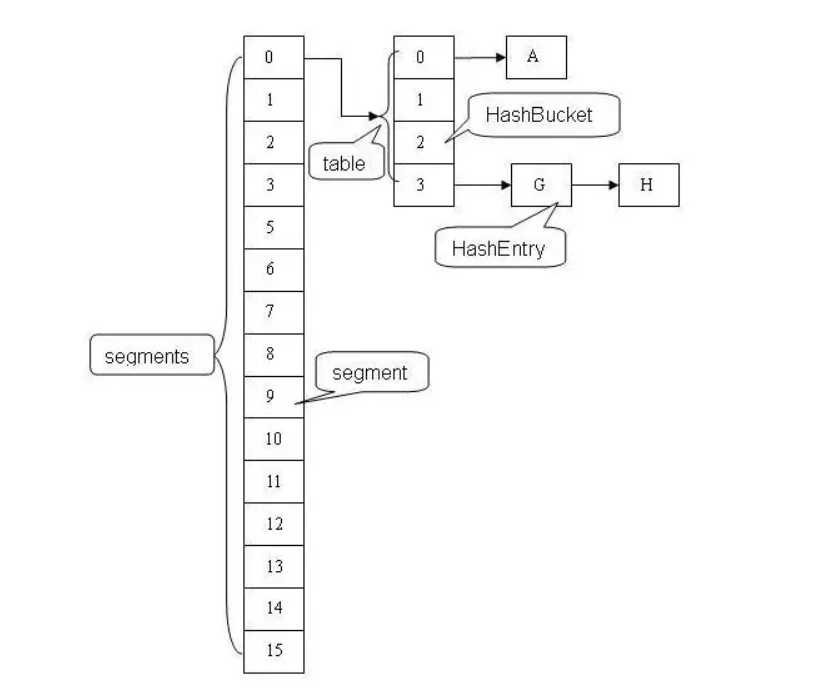
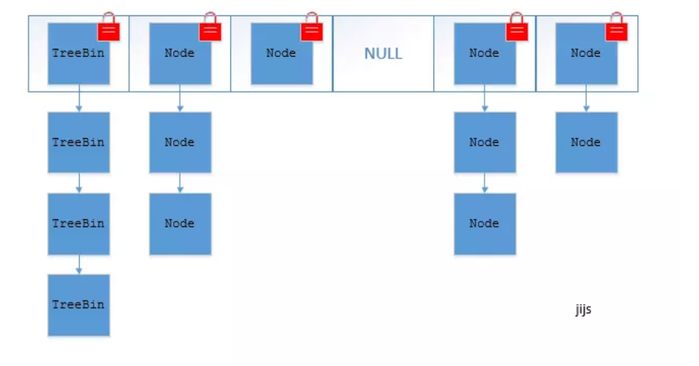

# Hashtable
## Hashtable与HashMap的区别
- Hashtable继承自Dictionary类，而HashMap继承自AbstractMap类。但二者都实现了Map接口。
- Hashtable中的所有方法都用synchronized关键字修饰，使用的时候不需要自己去同步。
- Key和value都不允许出现Null值
- HashTable直接使用对象的hashCode而HashMap重新计算hash值。
- HashTable中hash数组默认大小是11，增加的方式是 old*2+1。
- 还多了Contains等方法。
>由于HashTable在每个方法中都使用synchronized，因此在高并发的情况下其性能仍然比较差。

# ConcurrentHashMap

## 内存结构
- JDK1.8之前

- JDK1.8之后

## 性能提升
- JDK1.8之前
ConcurrentHashMap使用的是分段锁技术,将ConcurrentHashMap将锁一段一段的存储，然后给每一段数据配一把锁（segment），当一个线程占用一把锁（segment）访问其中一段数据的时候，其他段的数据也能被其它的线程访问，默认分配16个segment。默认比Hashtable效率提高16倍。

- JDK1.8之后
ConcurrentHashMap取消了segment分段锁，而采用CAS和synchronized来保证并发安全。数据结构跟HashMap1.8的结构一样，数组+链表/红黑二叉树。
synchronized只锁定当前链表或红黑二叉树的首节点，这样只要hash不冲突，就不会产生并发，效率又提升N倍。