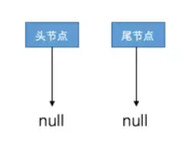
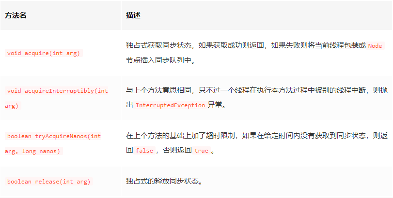
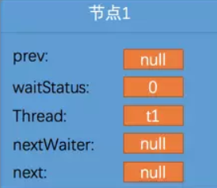
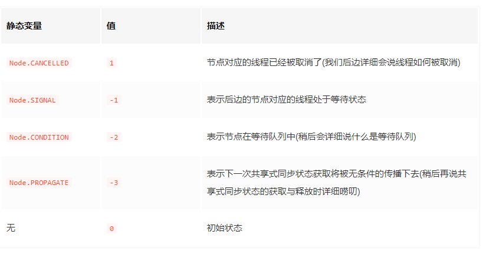
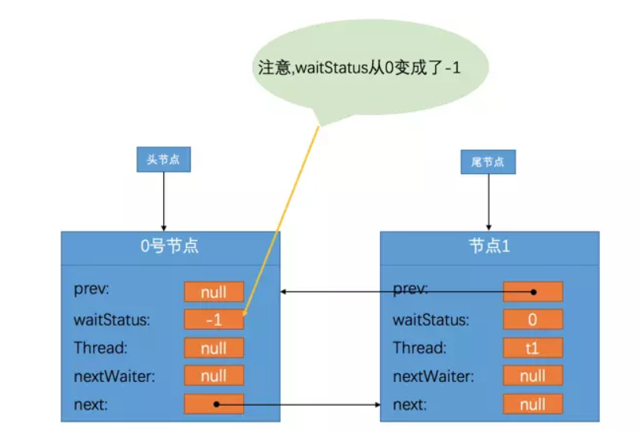
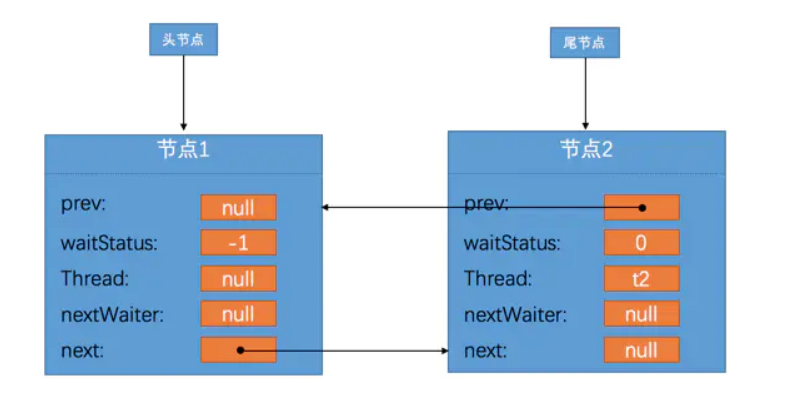

# AQS

## 同步状态
在AQS中维护了一个名叫state的字段，是由volatile修饰的，它就是所谓的同步状态：
`private volatile int state;`
并且提供了几个访问这个字段的方法：
- protected final int getState(): 获取state的值
- protected final void setState(int newState): 设置state的值
- protected final boolean compareAndSetState(int expect, int update): 使用CAS方式更新state的值

## 基于同步状态实现的两种模式
### 独占模式
比如在独占模式下，我们可以把state的初始值设置成0，每当某个线程要进行某项独占操作前，都需要判断state的值是不是0，如果不是0的话意味着别的线程已经进入该操作，则本线程需要阻塞等待；如果是0的话就把state的值设置成1，自己进入该操作。这个先判断再设置的过程我们可以通过CAS操作保证原子性，我们把这个过程称为尝试获取同步状态。如果一个线程获取同步状态成功了，那么在另一个线程尝试获取同步状态的时候发现state的值已经是1了就一直阻塞等待，直到获取同步状态成功的线程执行完了需要同步的操作后释放同步状态，也就是把state的值设置为0，并通知后续等待的线程。

### 共享模式
在共享模式下的道理也差不多，比如说某项操作我们允许10个线程同时进行，超过这个数量的线程就需要阻塞等待。那么我们就可以把state的初始值设置为10，一个线程尝试获取同步状态的意思就是先判断state的值是否大于0，如果不大于0的话意味着当前已经有10个线程在同时执行该操作，本线程需要阻塞等待；如果state的值大于0，那么可以把state的值减1后进入该操作，每当一个线程完成操作的时候需要释放同步状态，也就是把state的值加1，并通知后续等待的线程。

### 独占模式的demo
```
public class AQSExclusiveLock{
    public static void main(String[] args) {
        ExclusiveLock lock = new ExclusiveLock();
        Thread threadA = new Thread(new Runnable() {
            public void run() {
                    lock.tryAcquire(1);
                    for (int i = 0; i < 10; i++) {
                        System.out.println("A");
                    }
                    lock.tryRelease(1);
            }
        });
        Thread threadB = new Thread(new Runnable() {
            public void run() {
                try {
                    Thread.sleep(1000);
                } catch (InterruptedException e) {
                    e.printStackTrace();
                }
                lock.tryAcquire(1);
                    for (int i = 0; i < 10; i++) {
                        System.out.println("B");
                    }
                lock.tryRelease(1);
            }
        });
        threadA.start();
        threadB.start();
    }
}

class ExclusiveLock extends AbstractQueuedSynchronizer{
    @Override
    protected boolean tryAcquire(int arg) {
        return compareAndSetState(0,1);
    }

    @Override
    protected boolean tryRelease(int arg) {
        setState(0);
        return true;
    }

    @Override
    protected boolean isHeldExclusively() {
        return getState() == 1;
    }
}
```
>如何保证A一定在B之前获取锁？这里我对B线程使用了sleep性能肯定很差。

## 同步队列
AQS中还维护了一个所谓的同步队列，这个队列的节点类被定义成了一个静态内部类，它的主要字段如下：
```
static final class Node {
    volatile int waitStatus;//这个变量的状态对应怎样的信息
    volatile Node prev;
    volatile Node next;
    volatile Thread thread;
    Node nextWaiter;
    
    static final int CANCELLED =  1;
    static final int SIGNAL    = -1;
    static final int CONDITION = -2;
    static final int PROPAGATE = -3;
}
```
AQS中定义一个头节点引用，一个尾节点引用：
```
private transient volatile Node head;
private transient volatile Node tail;
```
可以看到Node类中有一个Thread类型的字段，这表明每一个节点都代表一个线程。我们期望的效果是当一个线程获取同步状态失败之后，就把这个线程阻塞并包装成Node节点插入到这个同步队列中，当获取同步状态成功的线程释放同步状态的时候，同时通知在队列中下一个未获取到同步状态的节点，让该节点的线程再次去获取同步状态。

## 独占模式下同步状态的获取和释放
### 同步状态的获取
在独占模式下，同一个时刻只能有一个线程获取到同步状态，其他同时去获取同步状态的线程会被包装成一个Node节点放到同步队列中，直到获取到同步状态的线程释放掉同步状态才能继续执行。

初始状态的同步队列是一个空队列，里边一个节点也没有，就长这样：



获取和释放同步状态的方式是由我们自定义的，在独占模式需要我们定义AQS的子类并且重写下边这些方法：
```
protected boolean tryAcquire(int arg)
protected boolean tryRelease(int arg)
protected boolean isHeldExclusively()
```
在定义了这些方法后，谁去调用它们呢？AQS里定义了一些调用它们的方法，这些方法都是由public final修饰的：


acquire方法的源代码：
```
public final void acquire(int arg) {
    if (!tryAcquire(arg) &&
        acquireQueued(addWaiter(Node.EXCLUSIVE), arg))
        selfInterrupt();
}
```
代码显示`acquire`方法实际上是通过`tryAcquire`方法来获取同步状态的，如果`tryAcquire`方法返回`true`则结束，如果返回`false`则继续执行。这个`tryAcquire`方法就是我们自己规定的获取同步状态的方式。假设现在有一个线程已经获取到了同步状态，而线程t1同时调用`tryAcquire`方法尝试获取同步状态，结果就是获取失败，会先执行`addWaiter`方法，看一下这个方法：
```
private Node addWaiter(Node mode) {
    Node node = new Node(Thread.currentThread(), mode);  //构造一个新节点
    Node pred = tail;
    if (pred != null) { //尾节点不为空，插入到队列最后
        node.prev = pred;
        if (compareAndSetTail(pred, node)) {       //更新tail，并且把新节点插入到列表最后
            pred.next = node;
            return node;
        }
    }
    enq(node);
    return node;
}

private Node enq(final Node node) {
    for (;;) {
        Node t = tail;
        if (t == null) {    //tail节点为空，初始化队列
            if (compareAndSetHead(new Node()))  //设置head节点
                tail = head;
        } else {    //tail节点不为空，开始真正插入节点?为什么说这个时候开始正在插入节点？？？
            node.prev = t;
            if (compareAndSetTail(t, node)) {
                t.next = node;
                return t;
            }
        }
    }
}
```
可以看到，这个addWaiter方法就是向队列中插入节点的方法。首先会构造一个Node节点，假设这个节点为节点1，它的thread字段就是当前线程t2，这个节点被刚刚创建出来的样子就是这样：


然后我们再分析一下具体的插入过程。如果tail节点不为空，直接把新节点插入到队列后边就返回了，如果tail节点为空，调用enq方法先初始化一下head和tail节点之后再把新节点插入到队列后边。enq方法的这几行初始化队列的代码需要特别注意：
```
if (t == null) {    //tail节点为空，初始化队列
    if (compareAndSetHead(new Node()))  //设置head节点
        tail = head;
} else {
    //真正插入节点的过程
}
```
addWaiter方法调用完会返回新插入的那个节点，也就是节点1，acquire方法会接着调用acquireQueued方法：
```
final boolean acquireQueued(final Node node, int arg) {
    boolean failed = true;
    try {
        boolean interrupted = false;
        for (;;) {
            final Node p = node.predecessor();  //获取前一个节点
            if (p == head && tryAcquire(arg)) { 前一个节点是头节点再次尝试获取同步状态
                setHead(node);
                p.next = null; // help GC
                failed = false;
                return interrupted;
            }
            if (shouldParkAfterFailedAcquire(p, node) &&
                parkAndCheckInterrupt())
                interrupted = true;
        }
    } finally {
        if (failed)
            cancelAcquire(node);
    }
}
```
可以看到，如果新插入的节点的前一个节点是头节点的话，会再次调用tryAcquire尝试获取同步状态，这个主要是怕获取同步状态的线程很快就把同步状态给释放了，所以在当前线程阻塞之前抱着侥幸的心理再试试能不能成功获取到同步状态，如果侥幸可以获取，那就调用setHead方法把头节点换成自己：
```
private void setHead(Node node) {
    head = node;
    node.thread = null;
    node.prev = null;
}
```
同时把本Node节点的thread字段设置为null，意味着自己成为了0号节点。
如果当前Node节点不是头节点或者已经获取到同步状态的线程并没有释放同步状态，那就乖乖的往下执行`shouldParkAfterFailedAcquire`方法：
```
private static boolean shouldParkAfterFailedAcquire(Node pred, Node node) {
    int ws = pred.waitStatus;   //前一个节点的状态
    if (ws == Node.SIGNAL)  //Node.SIGNAL的值是-1
        return true;
    if (ws > 0) {   //当前线程已被取消操作，把处于取消状态的节点都移除掉
        do {
            node.prev = pred = pred.prev;
        } while (pred.waitStatus > 0);
        pred.next = node;
    } else {    //设置前一个节点的状态为-1
        compareAndSetWaitStatus(pred, ws, Node.SIGNAL);
    }
    return false;
}
```
这个方法是对Node节点中的`waitStatus`的各种操作。如果当前节点的前一个节点的`waitStatus`是`Node.SIGNAL`，也就是-1，那么意味着当前节点可以被阻塞，如果前一个节点的`waitStatus`大于0，意味着该节点代表的线程已经被取消操作了，需要把所有`waitStatus`大于0的节点都移除掉，如果前一个节点的`waitStatus`既不是-1，也不大于0，就把前一个节点的`waitStatus`设置成`Node.SIGNAL`。
>为什么前一个节点的`waitStatus`大于0，需要把所有的节点都移除？



目前我们的当前节点是节点1，它对应着当前线程，当前节点的前一个节点是0号节点。在一开始，所有的Node节点的waitStatus都是0，所以在第一次调用`shouldParkAfterFailedAcquire`方法时，当前节点的前一个节点，也就是0号节点的waitStatus会被设置成`Node.SIGNAL`立即返回false，这个状态的意思就是说0号节点后边的节点都处于等待状态，现在的队列已经变成了这个样子：

由于`acquireQueued`方法是一个循环，在第二次执行到`shouldParkAfterFailedAcquire`方法时，由于0号节点的`waitStatus`已经为`Node.SIGNAL`了，所以`shouldParkAfterFailedAcquire`方法会返回true，然后继续执行`parkAndCheckInterrupt`方法：
```
private final boolean parkAndCheckInterrupt() {
    LockSupport.park(this);
    return Thread.interrupted();
}
public static void park(Object blocker) {
    Thread t = Thread.currentThread();
    setBlocker(t, blocker);
    UNSAFE.park(false, 0L);     //调用底层方法阻塞线程
    setBlocker(t, null);
}
```
这个就表示立即阻塞线程，这是一个底层方法，我们程序员就不用关心操作系统时如何阻塞线程的了。呼～至此，我们在独占模式下跑完了一个获取不到同步状态的线程是怎么被插入到同步队列以及被阻塞的过程。

### 同步状态的释放
如果一个线程在各种acquire方法中获取同步状态失败的话，会被包装成Node节点放到同步队列，这个可以看作是一个插入过程。有进就有出，如果一个线程完成了独占操作，就需要释放同步状态，同时把同步队列第一个(非0号节点)节点代表的线程叫醒，在我们上边的例子中就是节点1，让它继续执行，这个释放同步状态的过程就需要调用release方法了：
```
public final boolean release(int arg) {
    if (tryRelease(arg)) {
        Node h = head;
        if (h != null && h.waitStatus != 0)
            unparkSuccessor(h);
        return true;
    }
    return false;
}
```
可以看到这个方法会用到我们在AQS子类里重写的`tryRelease`方法，如果成功的释放了同步状态，那么就继续往下执行，如果头节点head不为null并且head的`waitStatus`不为0，就执行`unparkSuccessor`方法：
```
private void unparkSuccessor(Node node) {
        int ws = node.waitStatus;   //节点的等待状态
        if (ws < 0)
            compareAndSetWaitStatus(node, ws, 0);
        Node s = node.next; 
        if (s == null || s.waitStatus > 0) {    //如果node为最后一个节点或者node的后继节点被取消了
            s = null;
            for (Node t = tail; t != null && t != node; t = t.prev)   
                if (t.waitStatus <= 0)  //找到离头节点最近的waitStatus为负数的节点
                    s = t;
        }
        if (s != null)
            LockSupport.unpark(s.thread);   //唤醒该节点对应的线程
    }
```
我们现在的头节点head指向的是0号节点，它的状态为-1，所以它的`waitStatus`首先会被设置成0，接着它的后继节点，也就是节点1代表的线程会被这样调用`LockSupport.unpark(s.thread)`，这个方法的意思就是唤醒节点1对应的线程t2，把节点1的thread设置为null并把它设置为头节点，修改后的队列就长下边这样：
