# ReentrantLock
ReentrantLock首先是一个显式锁，它实现了Lock接口。
```
public interface Lock {
    void lock();
    void lockInterruptibly() throws InterruptedException;
    boolean tryLock();
    boolean tryLock(long time, TimeUnit unit) throws InterruptedException;
    void unlock();
    Condition newCondition();
}
```

## ReentrantLock的内部实现
其实ReentrantLock内部定义了一个AQS的子类来辅助它实现锁的功能，由于ReentrantLock是工作在独占模式下的，所以它的lock方法其实是调用AQS对象的aquire方法去获取同步状态，unlock方法其实是调用AQS对象的release方法去释放同步状态
```
public class ReentrantLock implements Lock {

    private final Sync sync;    //AQS子类对象
    
    abstract static class Sync extends AbstractQueuedSynchronizer { 
    }
    
}
```
## 创建ReentrantLock的初始状态
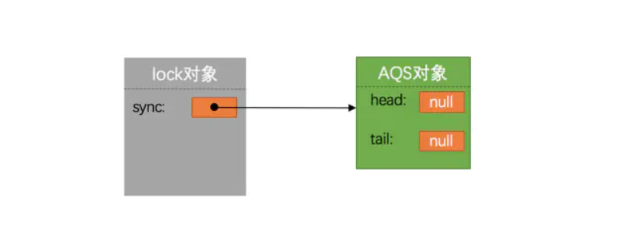

# Condition
在获取锁的线程因为某个条件不满足时，应该进入哪个等待队列，在什么时候释放锁，如果某个线程完成了该等待条件，那么在持有相同锁的情况下怎么从相应的等待队列中将等待的线程从队列中移出。

## 等待队列
在AQS中添加了一个名叫ConditionObject的成员内部类：
```
public abstract class AbstractQueuedSynchronizer {
    
    public class ConditionObject implements Condition, java.io.Serializable {
        private transient Node firstWaiter;
        private transient Node lastWaiter;

        // ... 为省略篇幅，省略其他方法
    }
}
```
很显然，这个ConditionObject维护了一个队列，firstWaiter是队列的头节点引用，lastWaiter是队列的尾节点引用。Node就是同步队列里用到的AQS的静态内部类Node:
```
static final class Node {
    volatile int waitStatus;
    volatile Node prev;
    volatile Node next;
    volatile Thread thread;
    Node nextWaiter;
    
    static final int CANCELLED =  1;
    static final int SIGNAL    = -1;
    static final int CONDITION = -2;
    static final int PROPAGATE = -3;
}
```
在等待队列中的线程被唤醒的时候需要重新获取锁，也就是重新获取同步状态，所以该等待队列必须知道线程是在持有哪个锁的时候开始等待的。

## 获取等待队列
ReentrantLock锁是怎么获取与它相关的等待队列的
```
public class ReentrantLock implements Lock {

    private final Sync sync;
    
    abstract static class Sync extends AbstractQueuedSynchronizer {
        final ConditionObject newCondition() {
            return new ConditionObject();
        }
        // ... 为节省篇幅，省略其他方法
    }
    
    public Condition newCondition() {
        return sync.newCondition();
    }
    
    // ... 为节省篇幅，省略其他方法
}
```
可以看到，其实就是简单创建了一个ConditionObject对象而已～ 由于 ConditionObject 是AQS 的成员内部类，所以在创建的 ConditionObject 对象中持有 AQS 对象的引用，所以通过 ConditionObject 对象访问到同步队列，也就是可以重新获取同步状态，也就是重新获取锁。

结合实例分析：
```
Lock lock = new ReentrantLock();
Condition condition = lock.newCondition();
```
由于在初始状态下，没有线程去竞争锁，所以同步队列是空的，也没有线程因某个条件不成立而进入等待队列，所以等待队列也是空的，ReentrantLock对象、AQS对象以及等待队列在内存中的表示就如图：
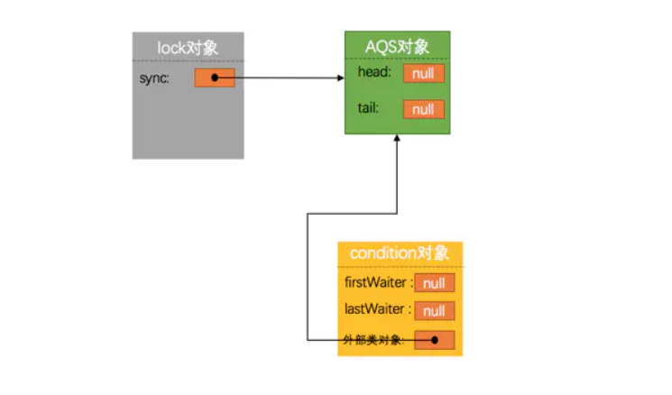
那接下来需要考虑怎么把线程包装成Node节点放到等待队列的以及怎么从等待队列中移出了。ConditionObject成员内部类实现了一个Condition的接口，这个接口提供了下边这些方法：
```
public interface Condition {
    void await() throws InterruptedException;
    long awaitNanos(long nanosTimeout) throws InterruptedException;
    boolean await(long time, TimeUnit unit) throws InterruptedException;
    boolean awaitUntil(Date deadline) throws InterruptedException;
    void awaitUninterruptibly();
    void signal();
    void signalAll();
}
```
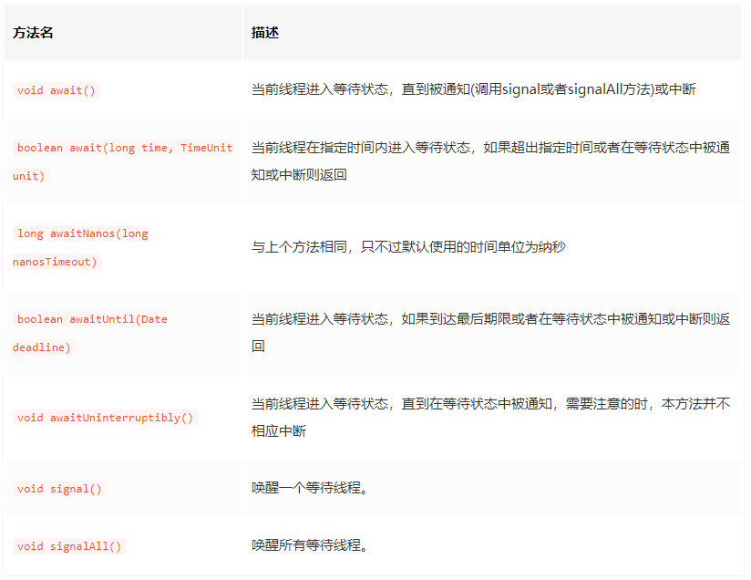
像调用内置锁的wait/notify方法时，线程需要首先获取该锁一样，调用Condition对象的await/siganl方法的线程需要首先获得产生该Condition对象的显式锁。它的基本使用方式就是：通过显式锁的 newCondition 方法产生Condition对象，线程在持有该显式锁的情况下可以调用生成的Condition对象的 await/signal 方法，一般用法如下：
```
Lock lock = new ReentrantLock();

Condition condition = lock.newCondition();

//等待线程的典型模式
public void conditionAWait() throws InterruptedException {
    lock.lock();    //获取锁
    try {
        while (条件不满足) {
            condition.await();  //使线程处于等待状态
        }
        条件满足后执行的代码;
    } finally {
        lock.unlock();    //释放锁
    }
}

//通知线程的典型模式
public void conditionSignal() throws InterruptedException {
    lock.lock();    //获取锁
    try {
        完成条件;
        condition.signalAll();  //唤醒处于等待状态的线程
    } finally {
        lock.unlock();    //释放锁
    }
}
```

## 实例分析

### 假设初始状态
```
Lock lock = new ReentrantLock();//锁
Condition condition1 = lock.newCondition();//等待队列1
Condition condition2 = lock.newCondition();//等待队列2
```
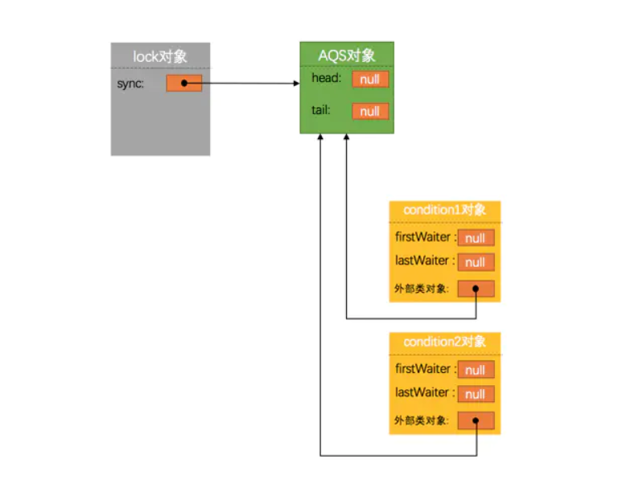
有3个线程main、t1、t2同时调用ReentrantLock对象的lock方法去竞争锁的话，只有线程main获取到了锁，所以会把线程t1、t2包装成Node节点插入同步队列，所以ReentrantLock对象、AQS对象和同步队列的示意图就是这样的：
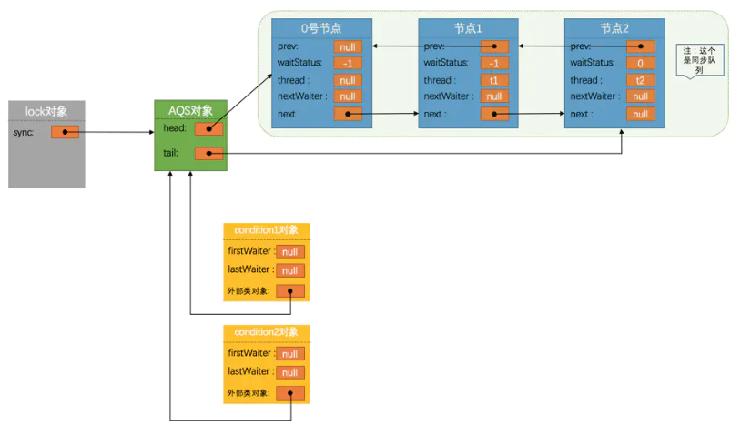
因为此时main线程是获取到锁处于运行中状态，但是因为某个条件不满足，所以它选择执行下边的代码来进入condition1等待队列：
```
lock.lock();
try {
    contition1.await();
} finally {
    lock.unlock();
}
```
分析这个`await`方法做了什么：
1. 在condition1等待队列中创建一个Node节点，这个节点的thread值就是main线程，而且waitStatus为-2，也就是静态变量Node.CONDITION，表示表示节点在等待队列中，由于这个节点是代表线程main的，所以就把它叫做main节点把，新创建的节点长这样：
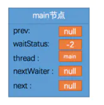
2. 将该节点插入condition1等待队列中：
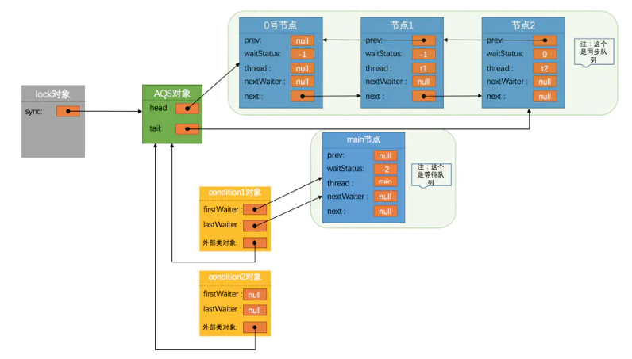
3. 因为main线程还持有者锁，所以需要释放锁之后通知后边等待获取锁的线程t，所以同步队列里的0号节点被删除，线程t获取锁，节点1称为head节点，并且把thread字段设置为null：
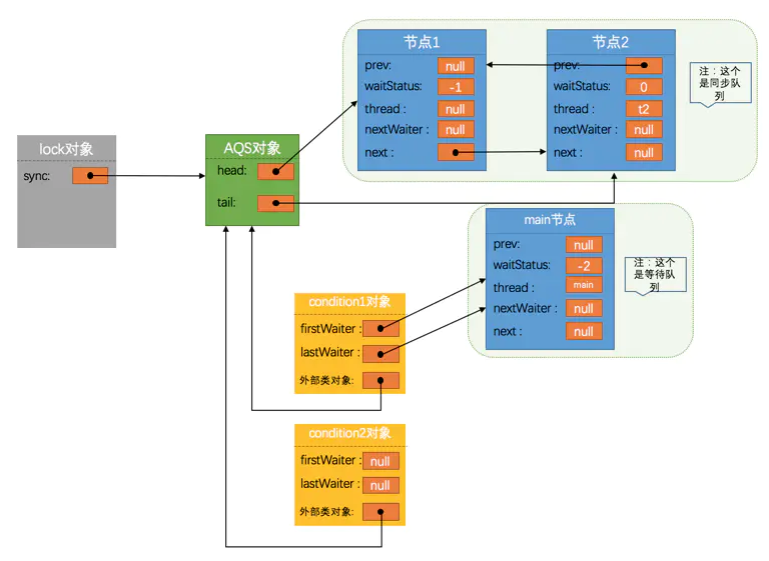
至此，main线程的等待操作就做完了，假如现在获得锁的t1线程也执行下边的代码：
```
lock.lock();
try {
    contition1.await();
} finally {
    lock.unlock();
}
```
还是会执行上边的过程，把t1线程包装成Node节点插入到condition1等待队列中去，由于原来在等待队列中的节点1会被删除，我们把这个新插入等待队列代表线程t1的节点称为新节点1吧：
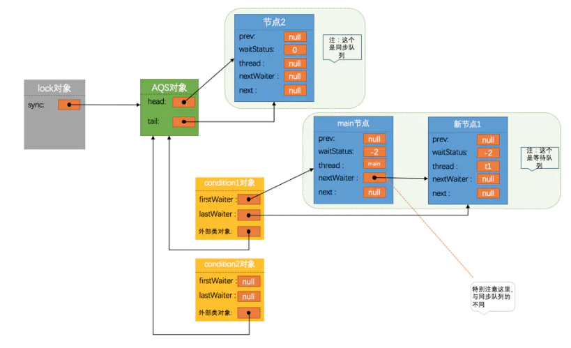

这里需要特别注意的是：同步队列是一个双向链表，prev表示前一个节点，next表示后一个节点，而等待队列是一个单向链表，使用nextWaiter表示下一个节点，这是它们不同的地方。
现在获取到锁的线程是t2，大家一起出来混的，前两个都进去，只剩下t2多不好呀，不过这次不放在condition1队列后头了，换成condition2队列吧：
```
lock.lock();
try {
    contition2.await();
} finally {
    lock.unlock();
}
```
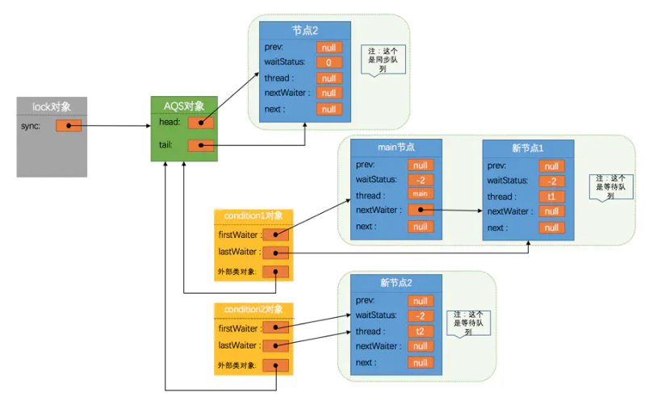
大家发现，虽然现在没有线程获取锁，也没有线程在锁上等待，但是同步队列里仍旧有一个节点，是的，同步队列只有初始时无任何线程因为锁而阻塞的时候才为空，只要曾经有线程因为获取不到锁而阻塞，这个队列就不为空了。
至此，main、t1和t2这三个线程都进入到等待状态了，都进去了谁把它们弄出来呢？？？额～ 好吧，再弄一个别的线程去获取同一个锁，比方说线程t3去把condition2条件队列的线程去唤醒，可以调用这个signal方法：
```
lock.lock();
try {
    contition2.signal();
} finally {
    lock.unlock();
}
```
因为在condition2等待队列的线程只有t2，所以t2会被唤醒，这个过程分两步进行：
1. 将在condition2等待队列的代表线程t2的新节点2，从等待队列中移出。
2. 将移出的节点2放在同步队列中等待获取锁，同时更改该节点的waitStauts为0。

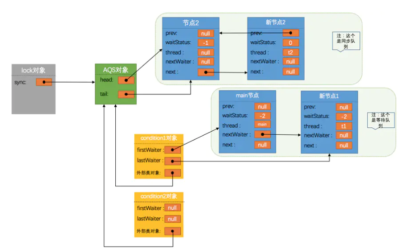

如果线程t3继续调用signalAll把condition1等待队列中的线程给唤醒也是差不多的意思，只不过会把condition1上的两个节点同时都移动到同步队列里：
```
lock.lock();
try {
    contition1.signalAll();
} finally {
    lock.unlock();
}
```
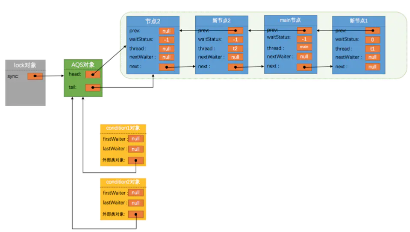

这样全部线程都从等待状态中恢复了过来，可以重新竞争锁进行下一步操作了。

