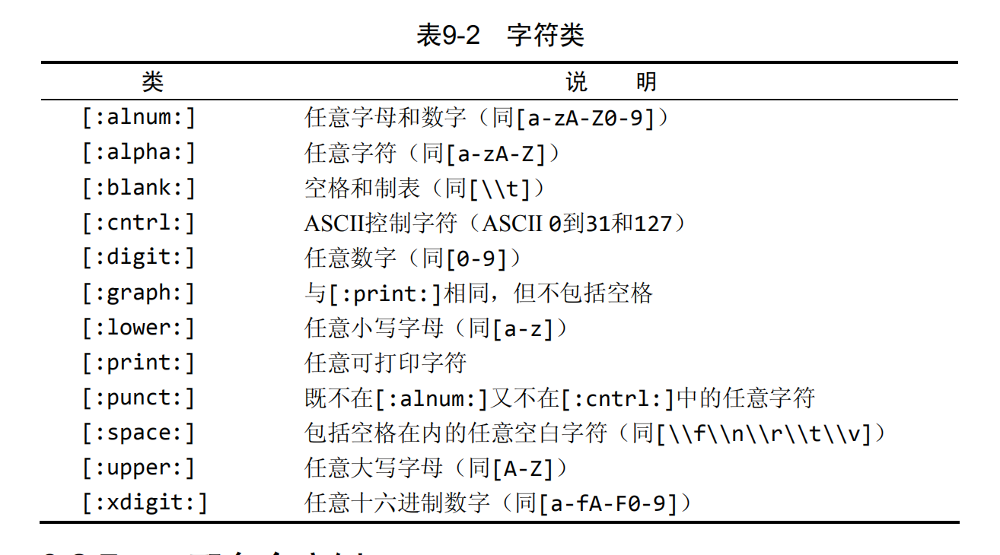
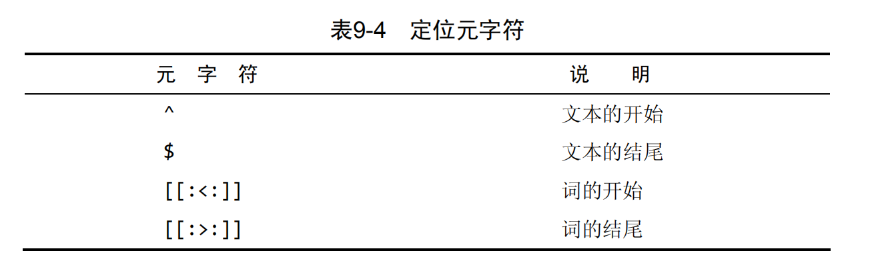

# 过滤和正则表达式的基本使用

```
# 使用通配符进行过滤
## % 代表任何字符出现任意次数,注意：% 不能匹配NULL
## _ 代表单个字符
##注意：
##不要过度使用通配符，因为它的速度非常慢，千万别放在开头，这样搜索速度非常慢
select * from test where username like '%1';
select * from test where username like '_1';


# 使用正则表达式
## REGEXP:匹配包含特定内容的列所在的行
select * from test where username REGEXP '1|2|3';
## [] 相对与 | 的组合使用
select * from test where username REGEXP '[1-4]';
## 匹配特殊字符：在特俗字符前面添加\\
select * from test where username REGEXP '\\.\\.';
## 重复元字符
select * from test where username REGEXP 'CodeAm 5[0]{4}';
## 字符类:匹配特定类型的数字或字符且连续
select * from test where username REGEXP '[[:digit:]]{4}';
## 定位元字符：^ $ [:<:] [:>:]
select * from test where username REGEXP '^[1-9\\.]';
## 如何测试正则
select 'hello' REGEXP '[0-9]';
```
>正则是难点，记得有时间过思考哦！


