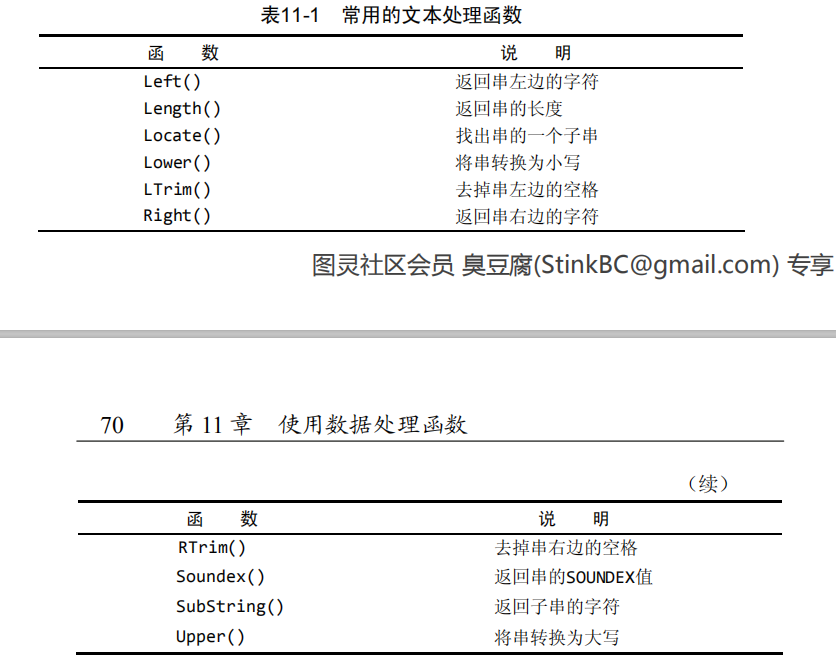
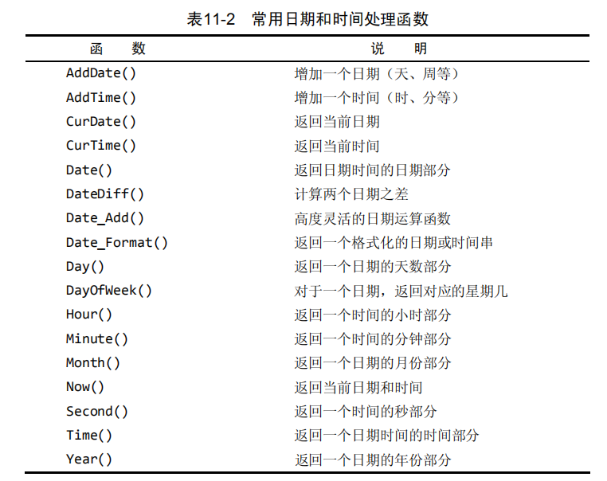
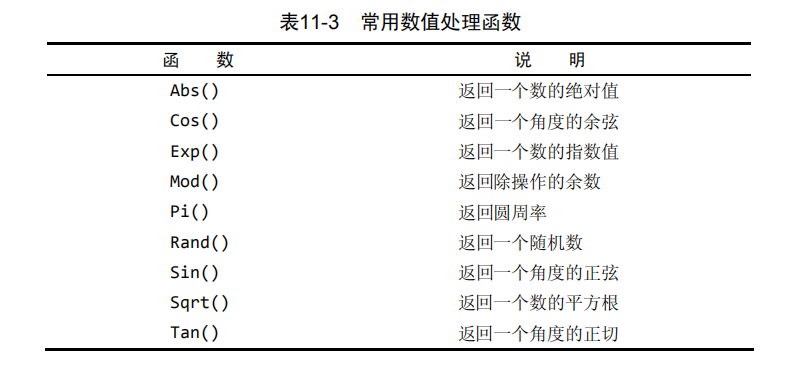

## 常用处理函数
```
# 计算字段
## 拼接字段 concat: 各个串之间用逗号间隔
select CONCAT(test.userid,'(',test.userpass,')') as concat from test limit 5;
## 删除空格 RTrim,LTrim,Trim
select TRIM(test.username) as delete_space from test where userpass='codeam';
## 计算总金额 直接使用算数表达式对多个字段进行处理
select test.number*test.price as total from test where username='user1';

# 使用函数
## 常用函数：Upper,Lower,Trim,SubString
select UPPER(test.username) as username_uper from test where price > 1;
## 日期和时间处理函数
## datetime,date
select test.username from test where Date(time) = '2020-03-01';
## 选取制定日期的订单
select * from test where Date(time) between '2020-03-02' and '2020-03-03';
select * from test where YEAR(time)='2020' and MONTH(time)='03';

# 汇总数据
## 聚集函数
## 常用的聚集函数：AVG,COUNT,MAX,MIN,SUM
select COUNT(userid) as user_num from test;
select AVG(number) number_avg from test;
select MAX(number) number_avg from test;
select COUNT(*) as user_num from test;
## 聚集不同值: DISTINCT可以先筛选出所有不同价格的值，在进行平均数的计算
select AVG(DISTINCT price) from test;
## 组合聚合函数
select COUNT(*) as pro_num,MIN(test.price) as min_price,MAX(test.price) as max_price,AVG(test.price) as avg_price from test;
## 聚合函数是高效设计，比自己在程序中去做要快的多。
```


