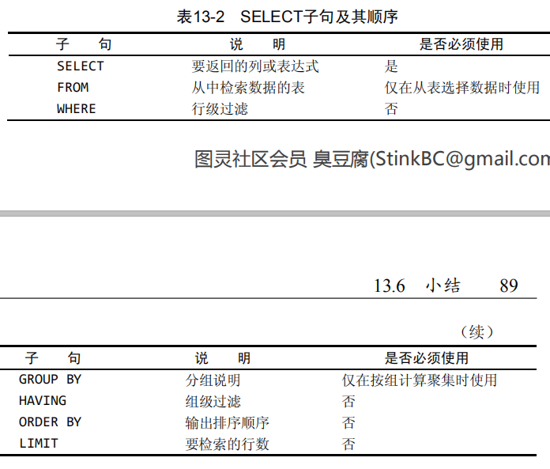

# 数据分组

## 分组数据
```
# 分组数据
## 在select语句的group by中确定
select name,AVG(salary.money),COUNT(*) as num from salary group by name with rollup ;
## GROUP BY 的使用规定
## 过滤分组
### HAVING：过滤分组，类似与where过滤行
select name from salary group by name having COUNT(*) > 2;
### having 与 where 的混合使用
select name, count(*) as numbers from salary where money > 100 group by name;
```

## 分组和排序
```
## 分组和排序
### 在分组的基础上根据分组后计算出的信息来排序
select name, count(*) as numbers from salary where money > 100 group by name order by numbers;
## select子句顺序
```
