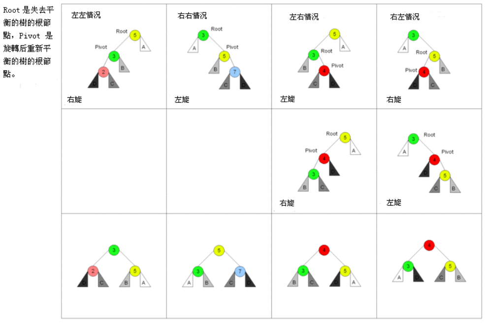
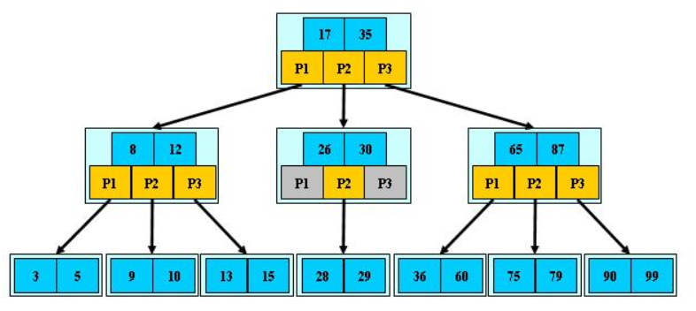
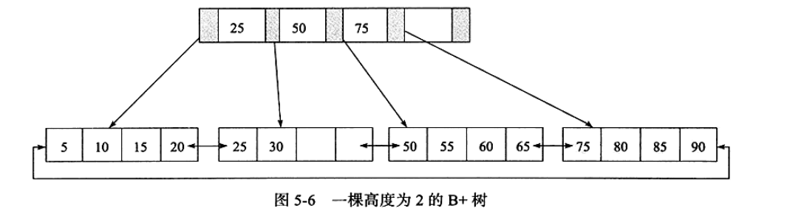
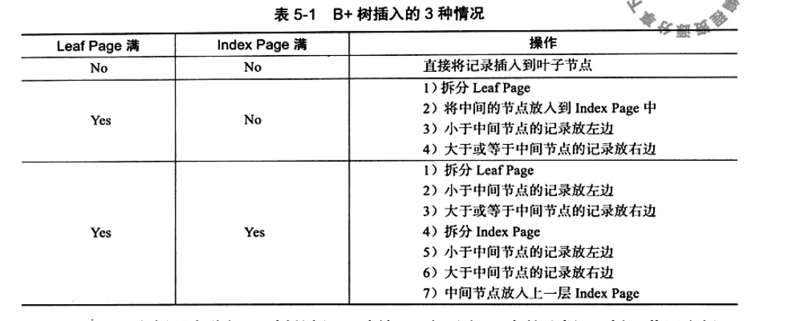
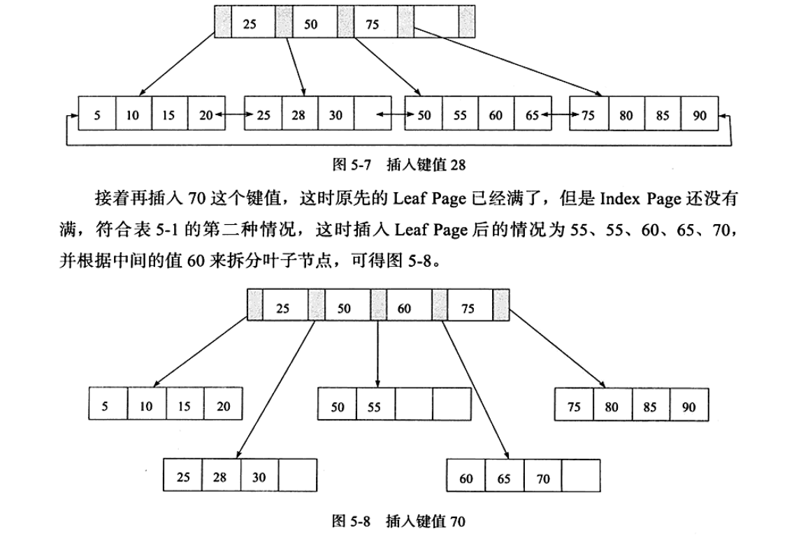
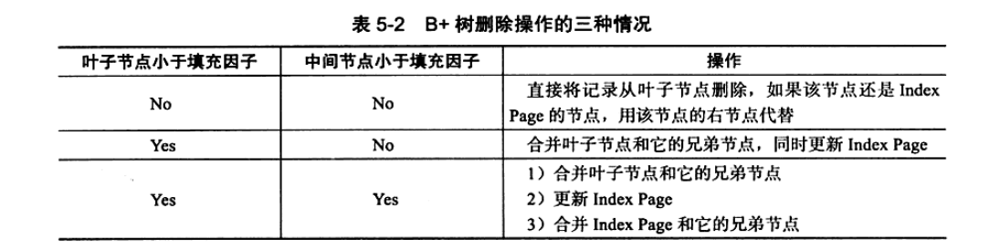
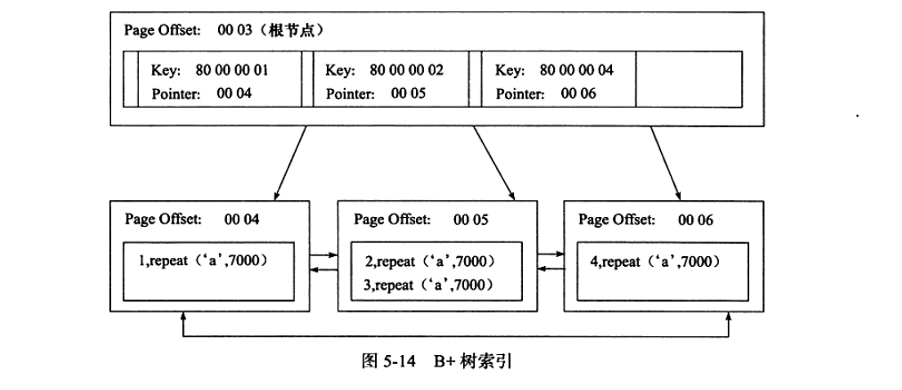

# 索引与算法

## InnoDB存储引擎支持的几种索引
- B+树索引
- 全文索引
- 哈希索引

## 二叉查找树和平衡二叉树

### 二叉查找树
>利用二分查找的原则，任意节点的左子树的值该节点的值，右子树的值大于该节点的值。

### 平衡二叉树
- 概念
平衡二叉树是基于二分法的策略提高数据的查找速度的二叉树的数据结构
- 特点
1. 非叶子节点最多拥有两个子节点；
2. 非叶子节值大于左边子节点、小于右边子节点；
3. 树的左右两边的层级数相差不会大于1;
4. 没有值相等重复的节点;

- 旋转

### B树(B-tree)
>B树和平衡二叉树稍有不同的是B树属于多叉树又名平衡多路查找树（查找路径不只两个），数据库索引技术里大量使用者B树和B+树的数据结构
- 特点
1. 根结点至少有两个子节点；
2. 每个非叶子节点并且非根节点最少有m/2个，即内部节点的字节点个数最少也有m/2个
3. 根节点最少有两个字节点。
4. 有k个关键字(关键字按递增次序排列)的非叶结点恰好有k+1个孩子。
5. 所有叶子节点在同一层，即所有叶子几点高度一致。

### B+树
>B+树是为磁盘或其他直接存储设备设计的一种平衡查找树。（Mysql技术内幕）

### B+树的插入操作
>由于B+树为了必须保证插入后的叶子节点中的记录依然排序，需要考虑多种情况。

- B+树的旋转操作
由于该存储结构主要用于磁盘，所以应该尽量避免拆分页(涉及到磁盘操作)的操作。

### B+树的删除操作
>B+树使用填充因子来控制树的删除变化。

### 有关问题
- 如果进行大批量删除操作后，怎么处理？

## B+树索引

### 聚集索引
>按照每张表的主键构建一棵B+树，同时叶子节点中存放的为整张表的记录数据。叶子节点也叫数据页，通过一个双向链表来链接。

- 优点
相当与字典的目录

1. 减少磁盘IO
2. 数据访问更快
3. 使用覆盖索引扫描的查询可以直接使用页节点中的主键值
4. 对于主键的范围查找和排序查找速度非常快。
- 缺点
1. 插入速度依赖与插入顺序
2. 更新索引的代价很高
3. 页分裂问题
4. 二级索引变大，因为与主索引有关
5. 二级索引查找的次数不只一次

### 辅助索引
>辅助索引和聚集索引一样，不同的是其叶子节点存储的数据是主键的值。

## Cardinality
>对于性别字段，只有2中取值，每一种情况都需要查找表中一半的数据，不适合使用B+。对于字段的取值范围很广，几乎没有重复，具有高选择性比较适用。

where 和连接里面涉及的字段 考虑覆盖等。

