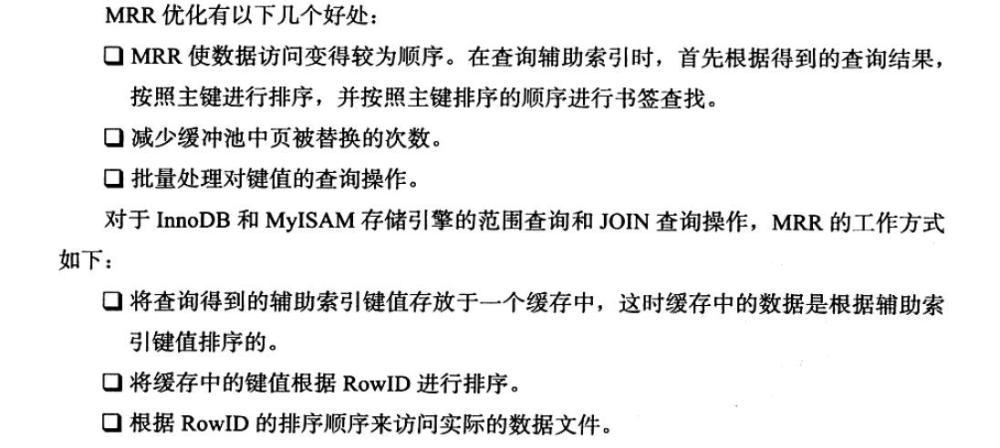
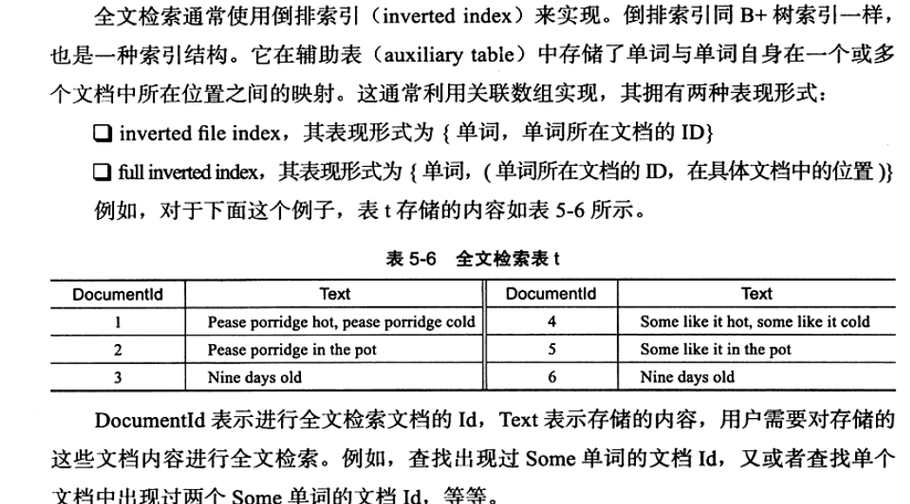
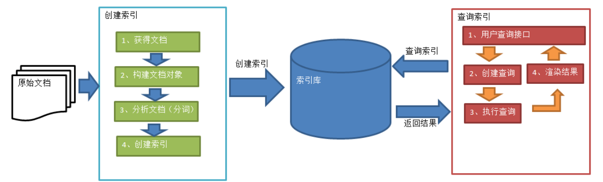
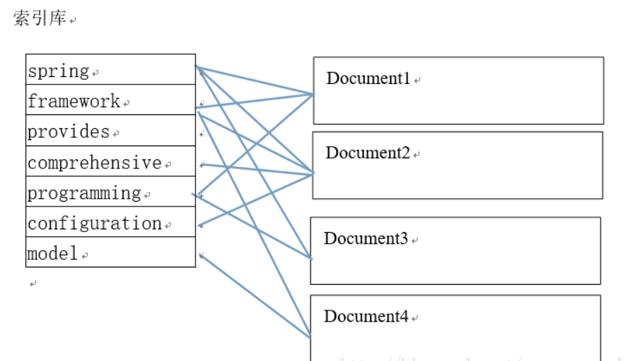

# 索引

## 联合索引

## 覆盖索引
>通过辅助索引查询到信息，不需要查询聚集索引中的记录减少回表操作。如果一个索引包含所有需要查询的字段的值，我们就称为覆盖索引。explain的输出结果Extra字段为Using index时，能够触发索引覆盖。

- 实现
1. 将被查询的字段，建立到联合索引里去。

- 使用场景
1. 全表conut查询
2. 列查询回表优化
3. 分页查询

## 优化器不使用索引的情况
1. 使用范围查找
2. 索引带有计算字段，like %开头等

## 索引提示
>显示的告诉mysql优化器使用哪个索引
- 使用场景
1. mysql错误的旋转了索引，导致查询速度慢。
2. 索引太多，优化器选择执行计划时间的开销可能会大于SQL语句本身。

## Multi-Range Read优化
>目的是为了减少磁盘的随机读写，并且将随机访问转化为顺序访问。

## 全文检索

### 非结构化数据查询方法
1. 顺序扫描法
所谓顺序扫描，比如要找内容包含某一个字符串的文件，就是一个文档一个文档的看，对于每一个文档，从头看到尾，如果此文档包含此字符串，则此文档为我们要找的文件，接着看下一个文件，直到扫描完所有的文件。如利用windows的搜索也可以搜索文件内容，只是相当的慢。
2. 全文检索
将非结构化数据中的一部分信息提取出来，重新组织，使其变得有一定结构，然后对此有一定结构的数据进行搜索，从而达到搜索相对较快的目的。这部分从非结构化数据中提取出的然后重新组织的信息，我们称之索引。 
例如：字典。字典的拼音表和部首检字表就相当于字典的索引，对每一个字的解释是非结构化的，如果字典没有音节表和部首检字表，在茫茫辞海中找一个字只能顺序扫描。然而字的某些信息可以提取出来进行结构化处理，比如读音，就比较结构化，分声母和韵母，分别只有几种可以一一列举，于是将读音拿出来按一定的顺序排列，每一项读音都指向此字的详细解释的页数。我们搜索时按结构化的拼音搜到读音，然后按其指向的页数，便可找到我们的非结构化数据——也即对字的解释。 
这种先建立索引，再对索引进行搜索的过程就叫全文检索(Full-text Search)。

### 如何实现全文检索
- 倒排索引

1. innodb会把单词拆分进行存储，查找时，根据单词匹配
2. 相关性：某条记录包含关键词的次数
>[全文索引较为详细的介绍](https://blog.csdn.net/qq_16162981/article/details/70142166)

## 索引的优点
1. 索引大大减少了服务器需要扫描的数据量
2. 索引可以帮助服务器避免排序和临时表
3. 索引可以将随机IO变为顺序IO

## 高性能索引策略
1. 独立的列
`explain select * from salary where id + 1 = 2; `
2. 前缀索引和索引选择性
比如城市。
3. 多列索引
4. 顺序问题
`explain select * from salary where id < 2 and name = 'codeam';`
分析 哪个条件对应的范围小，范围小的放前面。

## 参考文章
>[联合索引和多个单列索引](https://blog.csdn.net/Abysscarry/article/details/80792876)