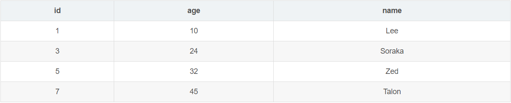

# 锁
## 表锁
## 行锁
### 1.Record Lock
>顾名思义，记录锁就是为某行记录加锁，它封锁该行的索引记录
```
-- id 列为主键列或唯一索引列
UPDATE SET age = 50 WHERE id = 1;
```
### 2.Gap Lock
>基于**非唯一索引**，它锁定一段范围内的索引记录。使用间隙锁锁住的是一个区间，而不仅仅是这个区间中的每一条数据。
```
SELECT * FROM table WHERE id BETWEN 1 AND 10 FOR UPDATE;
```
### 3.Next-Key Lock
> 每个数据行上的非唯一索引列上都会存在一把临键锁，当某个事务持有该数据行的临键锁时，会锁住一段左开右闭区间的数据。需要强调的一点是，InnoDB 中行级锁是基于索引实现的，临键锁只与**非唯一索引**列有关，在唯一索引列（包括主键列）上不存在临键锁。

该表中 age 列潜在的临键锁有：
(-∞, 10],
(10, 24],
(24, 32],
(32, 45],
(45, +∞],
在事务 A 中执行如下命令：
```
INSERT INTO table VALUES(100, 26, 'Ezreal');
```
事务 A 在对 age 为 24 的列进行 UPDATE 操作的同时，也获取了 (24, 32] 这个区间内的临键锁
在执行以下 SQL 时，也会陷入阻塞等待：
```
INSERT INTO table VALUES(100, 30, 'Ezreal');
```

## 锁的问题

- 幻读问题
是指同一事务，在连续执行两次同样的SQL语句可能导致不同的结果，第二次的SQL语句可能返回之前不存在的行。根本原因就是没有满足事物的隔离性。

- 脏读问题
是指一个事务读取到了没有提交事物的修改信息。

- 不可重复度
读取的数据被其它事物修改。

- 丢失更新
一个事务的操作会被另外一个事务所覆盖。

## 死锁
>是指两个或两个以上的事务在执行过程中，因争夺资源而造成的一种相互等待的现象。

### 解决方法
- 超时机制
- 等待图法
1. 数据库保存锁的信息链表
2. 事务的等待链表

## 锁升级
>数据库在适合的时候会自动地将行、键和分页锁升级为更粗粒度的表级锁。类似于Java中的锁粗化？

### 锁升级的情况
1. 由一句单独的SQL语句在一个对象上持有的锁的数量超过了阈值，默认5000.
2. 锁资源占用的内存超过了激活内存的40%。

