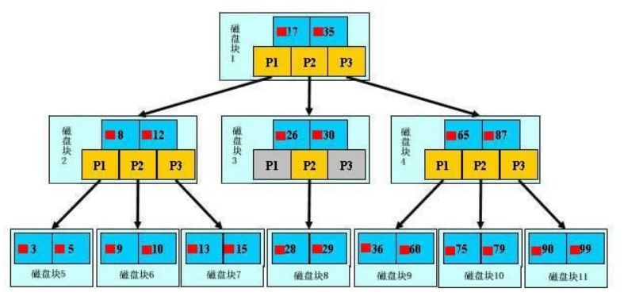
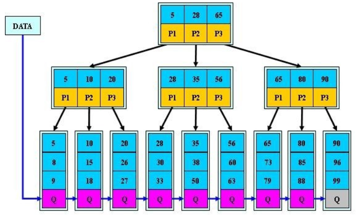
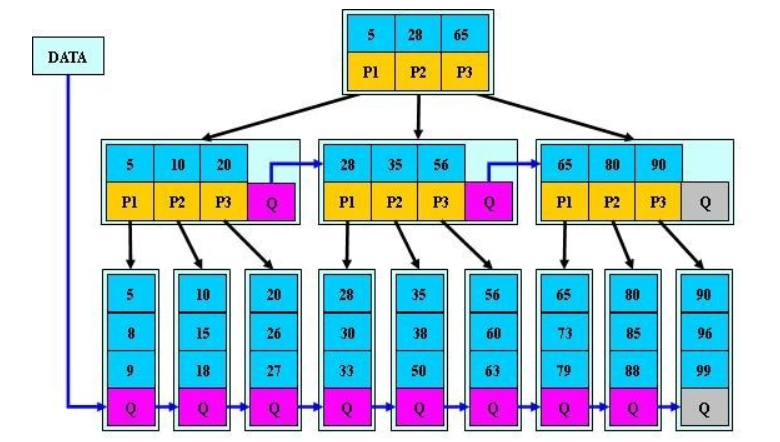

# B+树索引优化分析

## B树
>[参考博文](https://blog.csdn.net/v_july_v/article/details/6530142)

## B+树

### 异同点
1. 所有的叶子结点中包含了全部关键字的信息，及指向含有这些关键字记录的指针，且叶子结点本身依关键字的大小自小而大的顺序链接。 (而B 树的叶子节点并没有包括全部需要查找的信息)
2. 所有的非终端结点可以看成是索引部分，结点中仅含有其子树根结点中最大（或最小）关键字。 (而B 树的非终节点也包含需要查找的有效信息)

### B+树的优点
1. B+-tree的磁盘读写代价更低

B+-tree的内部结点并没有指向关键字具体信息的指针。因此其内部结点相对B 树更小。如果把所有同一内部结点的关键字存放在同一盘块中，那么盘块所能容纳的关键字数量也越多。一次性读入内存中的需要查找的关键字也就越多。相对来说IO读写次数也就降低了。

举个例子，假设磁盘中的一个盘块容纳16bytes，而一个关键字2bytes，一个关键字具体信息指针2bytes。一棵9阶B-tree(一个结点最多8个关键字)的内部结点需要2个盘快。而B+ 树内部结点只需要1个盘快。当需要把内部结点读入内存中的时候，B 树就比B+ 树多一次盘块查找时间(在磁盘中就是盘片旋转的时间)。

2. B+-tree的查询效率更加稳定

由于非终结点并不是最终指向文件内容的结点，而只是叶子结点中关键字的索引。所以任何关键字的查找必须走一条从根结点到叶子结点的路。所有关键字查询的路径长度相同，导致每一个数据的查询效率相当。

## B*树

B+树的分裂：当一个结点满时，分配一个新的结点，并将原结点中1/2的数据复制到新结点，最后在父结点中增加新结点的指针；B+树的分裂只影响原结点和父结点，而不会影响兄弟结点，所以它不需要指向兄弟的指针。

B*树的分裂：当一个结点满时，如果它的下一个兄弟结点未满，那么将一部分数据移到兄弟结点中，再在原结点插入关键字，最后修改父结点中兄弟结点的关键字（因为兄弟结点的关键字范围改变了）；如果兄弟也满了，则在原结点与兄弟结点之间增加新结点，并各复制1/3的数据到新结点，最后在父结点增加新结点的指针。

所以，B*树分配新结点的概率比B+树要低，空间使用率更高。

## B+树的分裂优化

### 传统B+树页面分裂操作分析：

按照原页面中50%的数据量进行分裂，针对当前这个分裂操作，3，4记录保留在原有页面，5，6记录，移动到新的页面。最后将新纪录7插入到新的页面中；
50%分裂策略的优势：
分裂之后，两个页面的空间利用率是一样的；如果新的插入是随机在两个页面中挑选进行，那么下一次分裂的操作就会更晚触发；
50%分裂策略的劣势：
空间利用率不高：按照传统50%的页面分裂策略，索引页面的空间利用率在50%左右；
分裂频率较大：针对如上所示的递增插入(递减插入)，每新插入两条记录，就会导致最右的叶页面再次发生分裂；