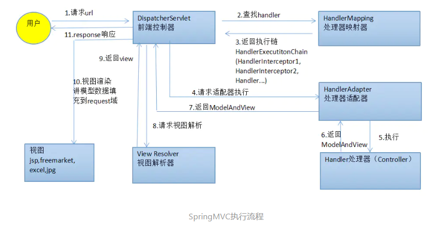

# SpringMVC

## SpringAOP流程

Spring工作流程描述
1. 用户向服务器发送请求，请求被Spring 前端控制Servelt DispatcherServlet捕获；
2. DispatcherServlet对请求URL进行解析，得到请求资源标识符（URI）。然后根据该URI，调用HandlerMapping获得该Handler配置的信息。
3. DispatcherServlet 根据获得的Handler信息，选择一个合适的HandlerAdapter。然后循环执行handler的pre 拦截器
4.  提取Request中的数据，填充Handler参数，开始执行Handler。
5.  Handler执行完成后，向DispatcherServlet 返回一个ModelAndView对象；
6.  根据返回的ModelAndView，选择一个适合的视图解析器，返回给DispatcherServlet ；
7. 视图解析器结合Model和View渲染视图
8. 将渲染结果返回给客户端。

## 参考资料
>[SprignMVC-1](https://juejin.im/post/5c3cadf56fb9a049ac796839)