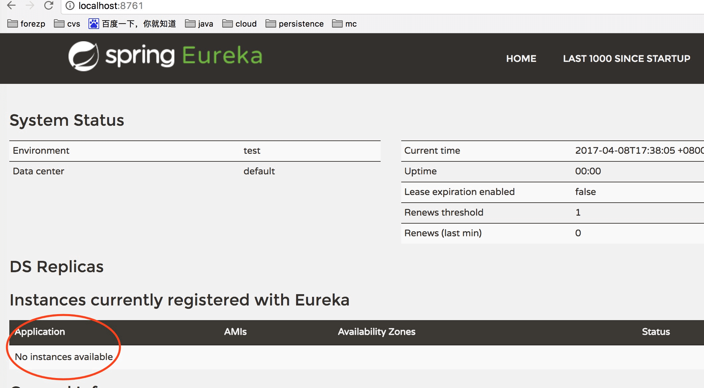

# Eureka

## 第一步根据官网教程创建springcloud-eureka项目
>这里有很多教程参考：[方志朋大牛](https://www.fangzhipeng.com/springcloud/2017/06/01/sc01-eureka.html)

## 第二部配置服务中心

### 启动注册服务中心
```
# 这个注解
@EnableEurekaServer
@SpringBootApplication
public class EurekaserverApplication {

	public static void main(String[] args) {
		SpringApplication.run(EurekaserverApplication.class, args);
	}
}
```

### 设置application配置文件
```
#定义服务名称
spring.application.name=springclouddemo

#定义普通参数
spring.http.encoding.force=true
spring.http.charset=UTF-8
spring.http.enabled=true

#定制本服务端口
server.port=8761
server.tomcat.uri-encoding=UTF-8

#eureka 注册服务
eureka.client.fetch-registry=false
eureka.client.register-with-eureka=false
eureka.instance.hostname=localhost
eureka.client.serviceUrl.defaultZone=http://${eureka.instance.hostname}:${server.port}/eureka/
```

### 第三步在网页中打开对应端口
>能在网页中看到注册中心页面中服务的信息。service，client的区别？
